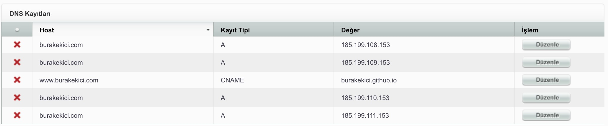
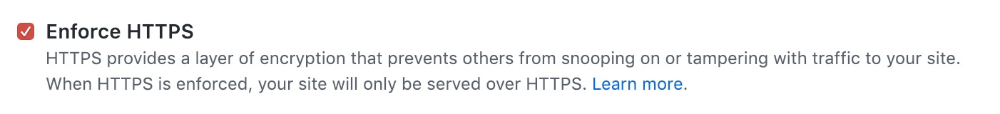

Merhaba, 

Elinizde bir adet özel alan adı (custom domain) var, bu alan adını GitHub Pages sunucularında barındırıyorsunuz ve bu siteye SSL sertifikası ekleyerek HTTPS bağlantısı kurulmasını istiyorsanız bu yazı sizin için. 

2017 Aralık ayında sitemi Wordpress'ten Jekyll'a taşımış ve GitHub sunucularında barındırmaya başlamıştım. 14 aydır herhangi bir sorun ya da zorluk yaşamadım. Bu geçişle ilgili [şöyle bir yazı](burakekici.com/tasindik) yazmıştım.

GitHub Pages, özel alan adları için 2018 Mayıs'ından itibaren HTTPS bağlantı desteği sunmaya [başlamış](https://github.blog/2018-05-01-github-pages-custom-domains-https/). Birkaç kısa adımda nasıl yapılacağına birlikte bakalım.

--- 

## HTTPS neden gerekli? 

**SSL** (Secure Sockets Layer), Güvenli Giriş Katmanı olarak adlandırılan bir sertifikadır. Ziyaret eden kişi ile ziyaret edilen site arasındaki veri iletişimini uçtan uca şifreleyerek gizli ve güvenilir bir bağlantı sağlanmasını sağlar. 

  

**HTTPS** ise SSL sertifikasına sahip site ile kurulan bağlantı protokolü. Açılımı Hyper Text Transfer Protocol Secure şeklinde. 

Peki HTTPS bağlantı bize ne sağlıyor? 

* Ziyaret edilen site ile güvenilir bir bağlantı kuruyor.
* HTTP'ye göre daha hızlı.
* Google sıralamasında daha üst sıralarda görünmesini sağlıyor.

 

## Hangi işlemler yapılmalı?

### 1. Alan adınızı satın aldığınız firmanın panelinden A Record'ları yeni GitHub IP'leriyle değiştirin.

GitHub HTTPS bağlantı desteğini aşağıdaki IP'ler üzerinden sunuyor. 


$ 185.199.108.153
$ 185.199.109.153
$ 185.199.110.153
$ 185.199.111.153


Alan adı hizmeti aldığınız firmanın paneline girerek A Record'ları yeni IP'ler ile değiştirin.

  

A Record ya da A Name'deki A, Address'i ifade ediyor. Yani alan adınızın ayağa kalkacağı sunucunun IP'lerini temsil ediyor. Detaylı bilgi [şurada](https://support.dnsimple.com/articles/a-record/).

### 2. GitHub repository'de custom domain'i silip yeniden ekleyin.

GitHub'da sitenizin bulunduğu repo'ya gidip ayarları açın. GitHub Pages sekmesine ilerleyin. 

Custom domain alanında yazan yazıyı silin, kaydedin, sonra yeniden ekleyip kaydedin. 

  

### 3. GitHub repository'de "Enforce HTTPS" kutucuğunu işaretleyin.

Yukarıdaki işlemi yaptıktan bir süre sonra Enforce HTTPS kutucuğu işaretlenebilir hale gelecek. İşaretleyin, çekinmeyin. 

  

### 4. Bekleyin.

Bundan sonrası sizde değil. En geç 24 saat içerisinde her şey yoluna girmiş olmalı. 

Bu süre zarfında aşağıdaki komut ile sitenizin hangi IP'lerde ayakta olduğunu görebilirsiniz. HTTPS desteği sunan yeni IP'leri görmeye başladığınızda işlem tamamlanmış demektir.


$ dig +noall +answer burakekici.com


Aşağıdaki bağlantılarla da test yapabilirsiniz.
* [TestMySite - Google](https://testmysite.thinkwithgoogle.com)
* [IsItDownRightNow](https://www.isitdownrightnow.com)

 

## Faydalı bağlantılar 

* [GitHub Help - Securing Your GitHub Pages Site with HTTPS](https://help.github.com/articles/securing-your-github-pages-site-with-https/)
* [GitHub Help - Troubleshooting Custom Domains](https://help.github.com/articles/troubleshooting-custom-domains/#https-errors)
* [GitHub Help - Using a Custom Domain with GitHub Pages](https://help.github.com/articles/using-a-custom-domain-with-github-pages/)

 
