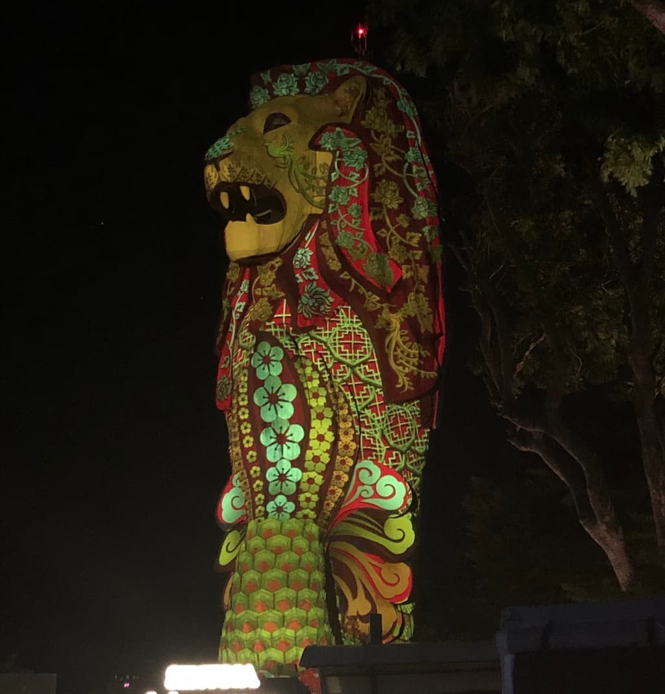
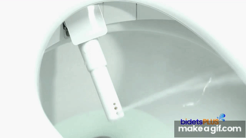

Merhaba, 

Google’ın IGA programı kapsamında, çalıştığım şirketi temsil etmek için Ağustos başında 1 haftalığına Singapur’a gittim. Bu yazıda da Singapur'a gitmeyi planlayanlar için birtakım bilgiler ve edindiğim izlenimleri paylaştım. 

## Singapur Hakkında Kısa Bilgiler

* **5.6 milyon nüfusa** sahip bir şehir-devlet. 
* Asya kıtasının en alt taraflarında, ekvatorun ise hemen üzerinde yer alıyor. 
* **1965** yılında Malezya'dan ayrılarak bağımsızlığını ilan etmiş.
* Nüfusun %73'ü Çinliler, %13'ü Malaylar, %9'u Hintler, %3 diğer uluslar oluşturuyor.
* Nüfusun %33'ü Budist, %19'u Hıristiyan, %18'i inançsız, %14'ü Müslüman, %10'u Taoist, %5'i Hindu ve %0.6'sı diğer dinlere mensup. Farklı görüşlere ve inançlara ne kadar saygılı oldukları aşikar.
* Satın alma paritesine göre kişi başına düşen gayri safi yurt içi milli hasıla değeri (GDP PPP) 103.717 USD (Dünyada 2. sırada).

* Singapur Türk vatandaşların 30 güne kadar olan turistik ziyaretleri için **vize istemiyor**. 

* Resmi dil İngilizce. Metroda, hava limanında hiçbir sorun yaşamıyorsunuz. Anonslar, levhalar İngilizce.
* Nüfusun %100'ü akıllı telefon kullanıyor. 
* Singapur 2020’de kağıt para kaldırıyor. Şehirde her şeyi kredi kartı ya da mobil ödeme sistemleri (Apple Pay vs.) ile halledebiliyorsunuz. Büyük kolaylık! 
* Trafik soldan akıyor. Trafikte araç kullanmak için de 2 farklı ehliyet varmış: pik saat ehliyeti ve normal ehliyet. 

## Yasaklar

* Ülke olarak kuralcılık konusunda epey katılar. 
* Tecavüz ve uyuşturucu ticaretinin cezası idam. 
* Yasak alanlarda sigara içmenin cezası 1000 Singapur doları civarında. 
* Şehire sakız sokmak, marketlerde sakız satmak, sakız taşımak yasak. 
* 'Duryan' adı verilen mendebur meyve ile trenlere otobüslere binmek yasak. Çok da isabetli olmuş! 😄 Bu İĞRENÇ kokulu 'meyveyi' tatmak gibi bir gaflete düşecek olursanız yanınızda kusmuk poşeti taşımanız iyi olabilir. 

## Gezilecek Yerler

Program boyunca tek boş günümüzün pazar günü olmasından ötürü, oldukça yoğun bir programla görülebilecek en popüler yerleri bir gün içinde gezdik. Zaten küçük bir şehir olduğundan çok da zorlanmadık. 21 kilometre yürüyüş + birkaç metro yolculuğu ile tamamladık. Gezdiğimiz yerler şunlardı:
* Botanical Garden
* Orchard Street
* Chinatown
* Sri Mriamman Temple
* Buddha Tooth Relic Temple 
* Marina Bay 
* Merlion
* Gardens by the Bay

Bu listedekileri tamamen yürüyerek gezdik. 35 derece sıcakta kolay olmasa da yürüyerek şehri keşfetmek için benim açımdan güzeldi. 

Şehir genel itibarıyla sıra dışı mimari yaklaşımları, oldukça özenli el işçilikleri ve inanılmaz ışık kullanımlarıyla öne çıkıyor. Özellikle Sentosa adasındaki Merlion'ın ışık şovunu defalarca izlememe rağmen yine olsa yine izlerim. 

Gezemediğimiz yerler:
* _Universal Studios_’a gitmek istedik ancak zamanımız yetmedi. Bir gün ayırmak gerekiyormuş buraya.
* _Singapore Flyer_ adlı dönme dolaba da binmeyi düşündük ancak kişi başı ücreti 80 Singapur doları (330 ₺) olunca gerek duymadık.
* Gece safarisi adında bir etkinlik var, adından da anlaşılabileceği üzere gece saatlerinde hayvanları ziyaret ediyorsunuz. Tekrar gitsem bunu da denemek isterdim sanırım.

## Yemekler

Benim için tüm seyahat boyunca en zorlayıcı şey sanırım yemeklerdi. Google sağ olsun, yemek çeşidi konusunda her ne kadar cömert olsa da neredeyse tamamı Asya mutfağına (Çin, Endonezya, Malezya, Tayland ve Hindistan...) ait yemekler olduğundan benim damak tadıma pek hitap etmedi. 

Ülke tropikal bir iklime sahip olduğu için bu iklime ait meyve sebzelere ulaşmak çok kolay. Örneğin ilk sabah kahvaltıda ıstakoz, üzerine de ejder meyvesiyle güne başlamak keyifliydi. 

Duryan denen gudubet meyveye de tekrar değinmeden edemedim. Bu meyve yüzünden bir uçak seferi ertelenmiş, haberi de şöyle bırakayım: [*](https://www.businessinsider.com/plane-grounded-foul-smelling-durian-fruit-indonesia-2018-11) 

Anthony Bourdain duryanın kokusunu şöyle tanımlamış epey güldüm ve çok doğru: 
> "Your breath will smell as if you'd been French-kissing your dead grandmother."

## Sentosa

Konakladığımız otel Sentosa adasındaydı. Bu ada daha çok turistik amaçlar için elle inşa edilmiş yapay bir adaymış. Hafif raylı sistemler ya da karayolu ile ulaşım sağlanıyor. Universal Studios da bu ada içerisinde. 

Şehir genelindeki 5 adet Merlion'dan bir tanesi de (ve en büyüğü) burada bulunuyor. Haftanın her günü akşamın belirli saatlerinde ışık gösterisi başlıyor. Açık alanda harika bir ses sistemi eşliğinde bu 10 dakikalık şovu izleyebiilirsiniz. 

  

Singapur'da kumar oynamak serbest ve Sentosa'da büyükçe bir kumarhane bulunuyor. İlgilenen olursa ziyaret edebilir. 

## Ve Singapur'un Yıldızı: Toto Washlet

Geldik en sevdiğim kısıma. Abi adamlar teknolojide çığır açmış. Toto Washlet diye bir dünya harikası var: çok fonksiyonlu akıllı klozet. Tuvaletin kapısını açıyorsun, klozetin kapağı otomatik açılıyor. Oturma yeri ısıtmalı. Ve taharet musluğuna ihtiyaç duyduğunda ise asıl maharet burada başlıyor. Suyun basıncını, ateşleme pozisyonunu seçiyorsunuz, başlıyor şovuna. Pulsating (titreşimli) ve oscillating (salınımlı) modlarını aktifleştirdiğinizde olanları ise anlatacak kelime bulamıyorum ahahaha. Yıkama bittikten sonra da kurutma özelliği var. Bitmedi. Çok afedersiniz götünüzü kaydedebiliyorsunuz ve User 1-2  profillerinden birine tıkladığınızda son ayarlarınız otomatik olarak seçiliyor. Aşağıda bir örnek GIF koydum. 😄 Tam bir teknoloji harikası. 

  

## Google IGA Etkinliği

Eveet. Güldük, eğlendik ancak sebebi ziyaretimiz Toto Washlet test etmek değildi elbette. 😁

Google çatısı altında düzenlenen Indie Games Accelerator etkinliği, dünya genelinden seçilen 30 firmanın oyun sektöründe daha iyi işler başarmasına altyapı hazırlayabilmek için düzenlenen bir eğitim programıydı. Bu programda da bizlere yine dünya çapında başarı göstermiş, oyun sektörünün önde gelen isimlerinden 30 mentor ve 30 adet de Googler destek oldu. 1'e 1 oturumlar, sunumlar, workshoplar derken bir hayli yoğun bir programı geride bıraktık. Etkinlikte öğrendiklerime dair bu yazıda bir şey paylaşmıyorum, belki bir başka yazıda. :) 

Şimdilik bu kadar, hoşça kalın!
