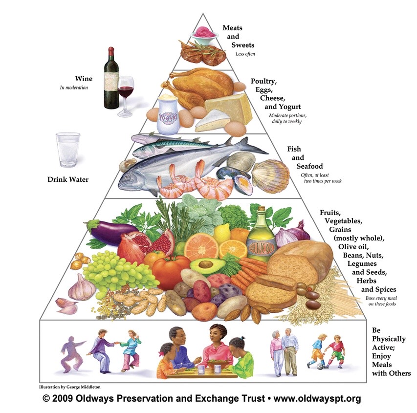
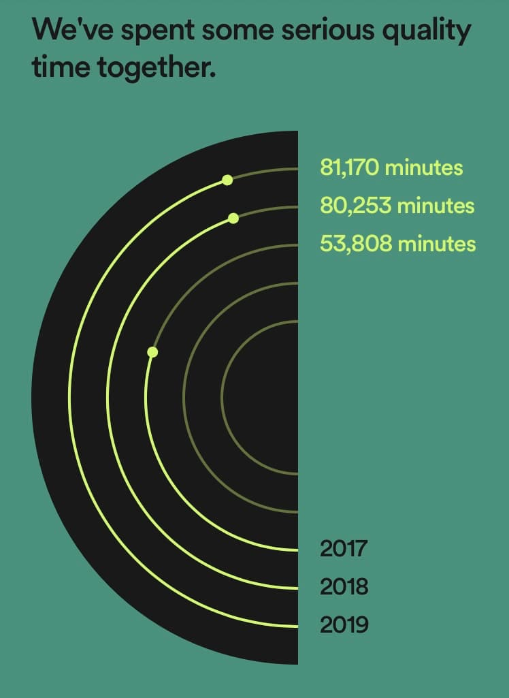
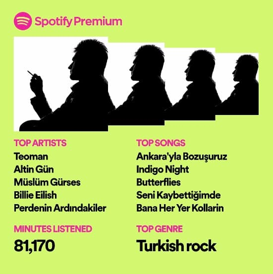
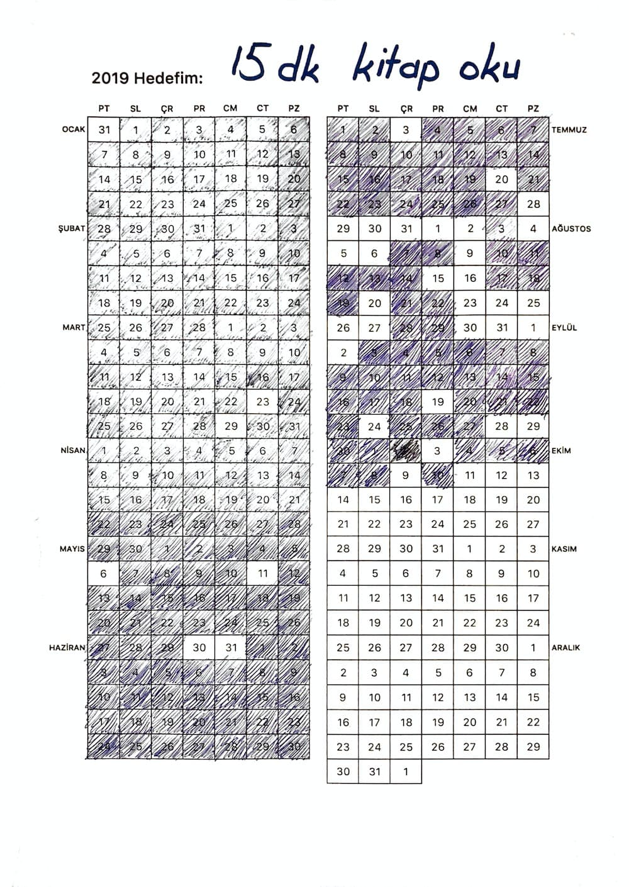
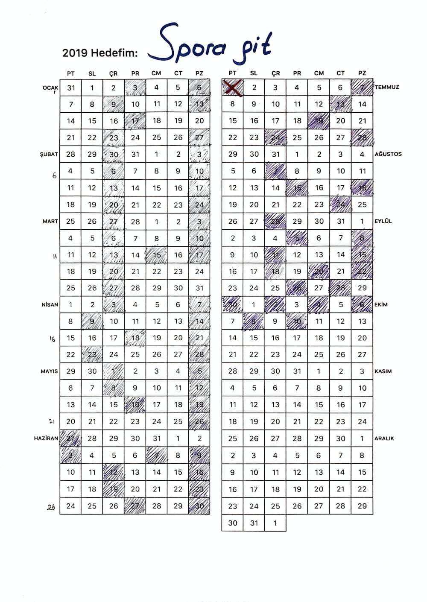
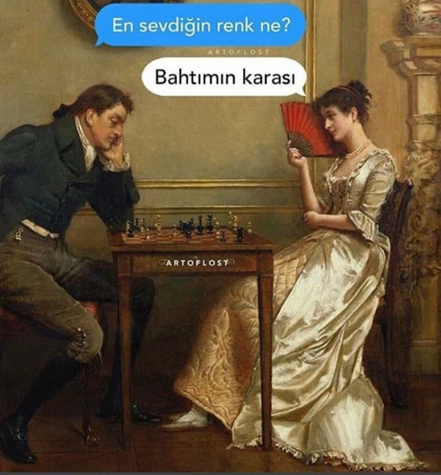

Merhaba, 

Üç yıldır olduğu gibi bu yıl da hayatımda ne gibi gelişmeler oldu, neler yaptım, nasıl yıkıldım gibi soruları yanıtladığım yazıya hoş geldiniz. Hızlıca başlayalım ve hızlıca bitirelim. 

---

# 2019: Neydik? Ne olduk?

### Taşınma

Bu yılın benim için en önemli gelişmesi taşınmak oldu. Eylül başında ayrı eve çıktım. Çoğu alışkanlıklarımı ve düzenimi yeniden revize ettim ve 4 aydır adapte olmaya çalışıyorum. 

Yeni Batı semtine taşındım. Hem trafik, hem otopark, hem de genel düzen anlamında eski oturduğum semt ile büyük farklar var. Anksiyetem azaldı. 😁

İç mimariye oldukça meraklı biri olarak eşyaları A'dan Z'ye kendim dizdim, itinayla renkleri seçtim, en ergonomik ürünleri bulmaya çalıştım. Canım dostum IKEA'nın da yollarını sıkça aşındırdım. 🙂 Tüm bu süreçte de çokça şey öğrendim. Hatta bununla ilgili bir yazı yazmayı da istedim ancak zaman kıtlığından mümkün olmadı. 

Tasarlama ve ev alışverişi sırasında da minimalist çizgimden hiç sapmadım. Her şeyi gerektiğince ve kararınca aldım. En sade ürünlerin peşinden koştum. 

Tabii ayrı eve çıkmak kolay değil, yemek temizlik çamaşır bulaşık gibi çokça sorumluluk geldi. Anneme de çokça vakit ayırmaya çalışıyorum. Böyle olunca zaman yönetimi tam bir kriz haline geldi. 

### İş

2019'da en büyük uğraşım çalışmaktı. Çok çalıştım. Meyvelerini ileride toplar mıyım bilemem ama geriye dönüp baktığımda aradaki farkı görebiliyorum. İyi ve kötü kararlar arasındaki ayrımı yapabiliyorum. Oyun geliştirmeye de epey adapte olduğumu düşünüyorum. 2020 umarım daha verimli bir yıl olur. 

Ayrıca yazılım alanında olup da yolun başında olan arkadaşlar okuyorsa teknik kitap okumanın çok önemli olduğunu tekrar belirtmek isterim. Önemli olan doğru mantaliteyi oturtmak, pratik zamanla oluyor. 

### Spor & Beslenme

Hayatta en önemli kaynağın sağlık olduğuna inanıyorum. Sağlıklı olmak için de spor ve sağlıklı beslenme olmazsa olmazlardan. 

Yıl boyu hem spor hem de beslenme konularında yine titiz olmaya çalıştım. 

Özellikle yeni eve taşınmamla birlikte yeni spor salonuna kaydoldum. Spor salonunun fiziki koşulları çok etkiliymiş bunu öğrendim. Eski salonum küçük olduğundan dolayı akşam pik saatlerde hem yeterince havadar olmuyordu hem de bazı aletlerde sıra beklemek gerekiyordu. Yeni salonun hem tavan yüksekliği, hem havalandırması, hem de alet sayısı iyi durumda olduğu için spor yapmak daha keyifli hale geldi. 

Sene başında 74.5 kilogramdım. Sene sonu hedefim 79 civarıydı, ancak 77'ye çıkabildim. Yeni yılda da tam gaz devam etmek önceliklerim arasında olacak. 

Bu yıl diyetimi de revize ettim ve Akdeniz diyetine doğru kaydım. Aşağıda bu diyeti özetleyen bir görsel mevcut.

  

### Kitaplar

Kitaplar açısından ilk aylarda güçlü bir başlangıç yaptım. Ne yazık ki yılın son ayları çok verimsizdi. GoodReads'teki 2019 Reading Challenge'da hedefimi 24 kitap olarak seçmiştim ama maalesef 14 kitapta kaldım. 

Yine de çok kaliteli kitaplar okudum. Bana çok şeyler kattı. İki hafta içerisinde okuduğum kitaplara ait bir yazı da yayımlayacağım kısmetse. Bağlantıyı da buraya iliştiririm. 

### Bedelli askerlik

2019'u şekillendiren olaylardan biri de yeni askerlik sisteminin açıklanmasıyla beraber gündemime aldığım bedelli askerlikti. Hangi anlamda şekillendirdiğini görmek istiyorsanız bedelli askerlik ücretini araştırabilirsiniz. 😅 Bırakmadılar yaşayalım.

### Singapur

Çalıştığım şirketin güzel jestiyle Ağustos başında 1 haftalığına Google IGA etkinliği için Singapur'a gittim. Tüm monotonluğun, ekonomik krizin, ayrı eve taşınmanın, bedelli askerliğin ortasında hoş bir değişim oldu. Her ne kadar yoğun ve yorucu bir etkinlik olsa da güzel anılar biriktirmemi ve ufkumun genişlemesini sağladı. Bu seyahate dair bir yazı yazmıştım, [buradan](../singapur) ulaşılabilir. 

### Spotify

Spotify'da bu yıl 81 bin dakika müzik dinlemişim. Sıkı bir kullanıcı olduğumu belirtmiştim. 🙂 

  

En çok dinlediğim sanatçı da favori sanatçım Teoman olmuş. Ve ilk kez İstanbul Arabesque Project ilk beşten düşmüş. 

  

Sebebi bu coğrafyanın getirisi mi, hayatın cilvesi mi, benim karakterim mi bilmiyorum ama 2019'da aşındırdığım 100 şarkıdan oluşan çalma listesinin büyük çoğunluğu melankolik şarkılardan oluşuyor (önceki yıllarda olduğu gibi 😛). Bu çalma listesi de hemen aşağıda:

<iframe src="https://open.spotify.com/embed/playlist/37i9dQZF1Etn75X3wYYxYQ" width="300" height="380" frameborder="0" allowtransparency="true" allow="encrypted-media"></iframe>

### Playstation

Boş vakitlerimde en çok zaman ayırdığım uğraşlarımdan Playstation'a bi başlık açmazsam ayıp olur. Bu yıl RDR2'de kovboy, Battlefield5'te çavuş, UFC3'te dayakçı, NFS'te yarışçı vs. olarak sağlam bir mesai yaptım. Detroit: Become Human, FIFA, NHL, Sims, Beyond Two Souls'da keyifle vakit harcadığım oyunlar arasındaydı. 

### Tiyatro, opera ve birtakım sanatsal aktiviteler

Ankara'da yaşamanın en güzel yanı sanırım bu sanatsal etkinliklere kolayca ulaşabilir olmak. Özellikle Devlet Tiyatrosu çok büyük nimet. Komik rakamlar karşılığında bu kadar kaliteli temsillere erişebiliyor olmak harika! 2019'da gittiğim temsiller arasında Profesyonel ve Lüküs Hayat favorilerimden. 

### Zinciri Kırma

Birkaç yıldır Zinciri Kırma tekniğini deniyorum. Bu yıl da uzun süre devam ettim ancak bi noktada bıraktım. Kitap ve spor için yılın ilk 9 ayı aşağıdaki görsellerde mevcut.

  

  

2020 için de Barış Özcan'ın paylaştığı Zinciri Kırma takvimini geçen yıl olduğu gibi her hafta alt alta gelecek şekilde yeniden tasarladım. [Buradan](../assets/images/2019/2020/calendar-2020.pdf) ilgili PDF'e ulaşabilirsiniz. 

### Kapanış

Ne demiştik geçen yıl, 
> "Hayat, siz planlar yaparken başınıza gelenlerdir."

Sahiden de hiç beklenmedik anlarda beklenmedik sürprizler olabiliyor. Bu yılın ortalarında annemin çeşitli sağlık sorunları ortaya çıktı. Hastane yollarını aşındırdığımız çok kötü birkaç ay geçti. Hayatta benim için en kıymetli insanın annem olduğunu göz önünde bulundurduğumuzda bu sürecin ne kadar yıpratıcı olduğunu tahmin edebilirsiniz belki. 

 

Şu görsel benim için bu yılı çok net anlatıyor, hem de komik :) 

  

Evet hem 2019'u, hem de 2010'lu yılları iki gün sonra noktalıyoruz. Acısıyla, tatlısıyla ve tekrar acısıyla koca bir on yıl daha geride kaldı. Hiç sanmıyorum ama umarım yeni on yıl daha keyifli, verimli ve huzurlu olur. (Ben de dahil) insanlar mutlu olsun istiyorum çok mu. 

--- 

# 2020: Hedefler

2020 için hedeflerimi detaylıca maddelendirmeyeceğim. Daha çok kitap, daha çok spor, bir tutam mutluluk ve bolca iç huzur. 

Burada noktalıyorum. 

 

2020'nin herkes için harika bir yıl olması dileklerimle! Esenlikler diliyorum. 🙂

 
