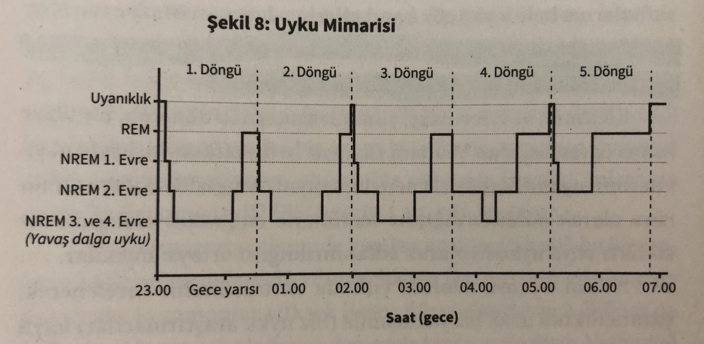
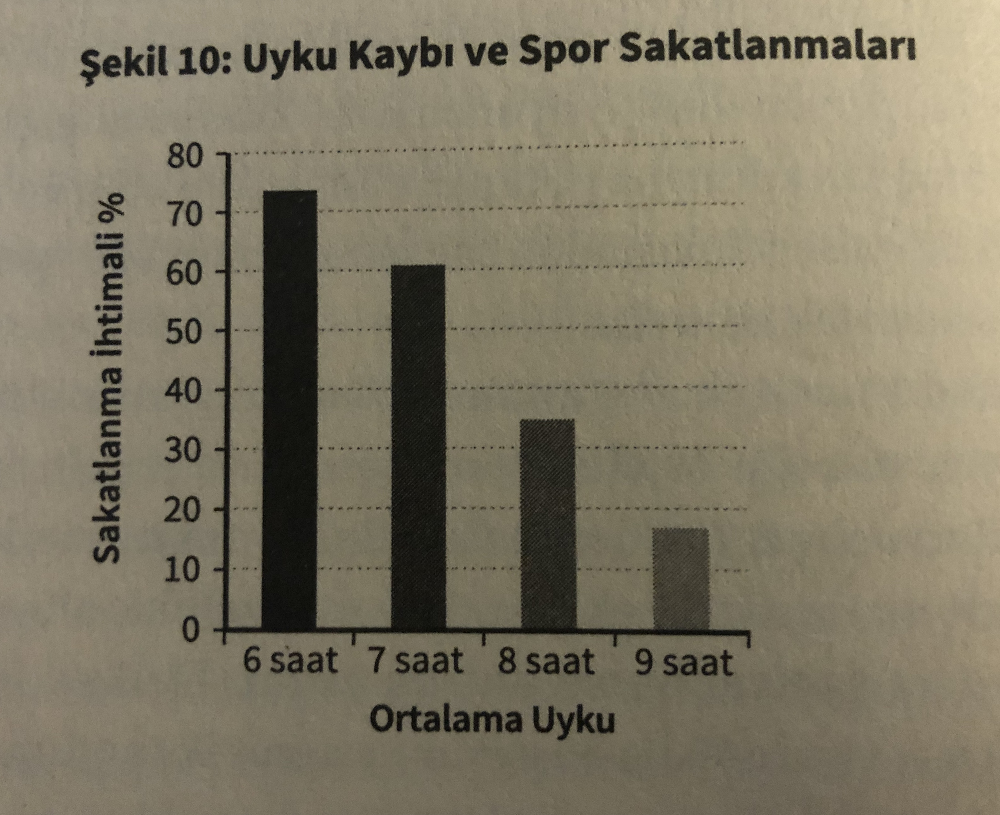
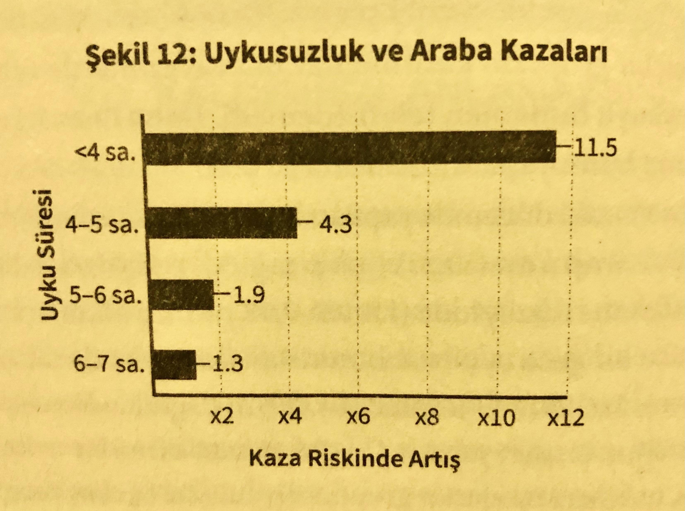
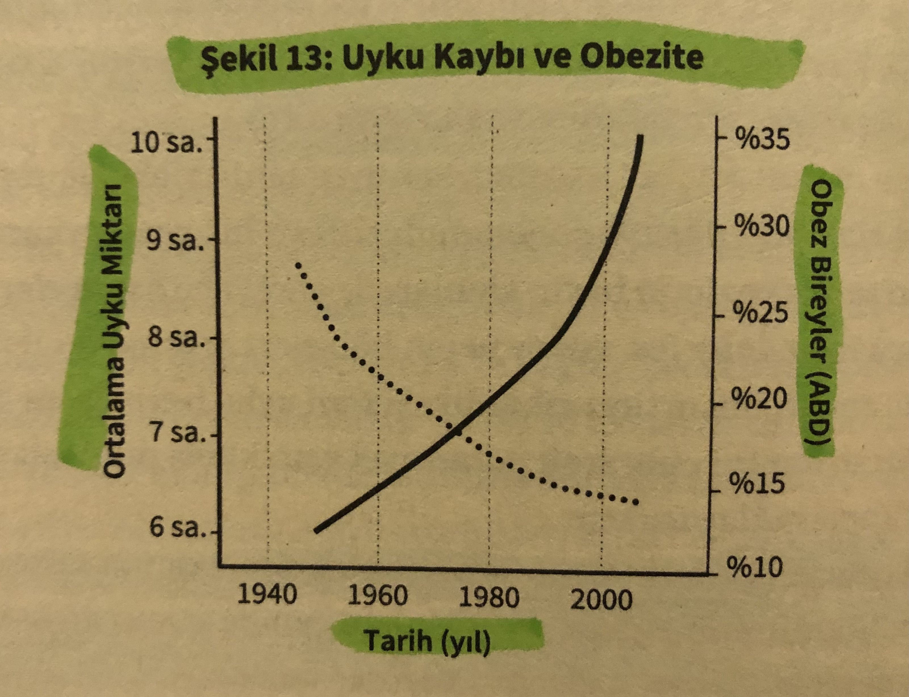

Merhaba,

Bu yazımda *Matthew Walker*'ın *Niçin Uyuruz?* isimli kitabından aldığım notlar ve alıntıları paylaştım. Kapanış bölümü hariç aşağıdaki satırların tamamı kitaptan alıntılardır. Çok fazla yazı olduğundan tek tek alıntı işareti eklemedim. Çok güzel bilgiler içerdiği için de daha fazla kısaltmak da istemedim. Kişisel önerim kitabı temin edip okumanız, ancak bir şekilde bu mümkün değilse bu yazıyı gözden geçirmenizi öneririm. Yaşam kalitenizi artıracak bilgiler içeriyor. 

 

## MÜTHİŞ BİR BULUŞ!

> "Bilim insanları ömrünüzü uzatan, **devrim niteliğinde** yeni bir tedavi keşfetti. Bu tedavi hafızanızı güçlendiriyor ve yaratıcılığınızı artırıyor. Daha çekici görünmenizi sağlıyor. İnce kalmanızı mümkün kılıyor ve aşırı yeme arzusunu azaltıyor. Sizi kanserden ve demanstan (bunama) koruyor. Soğuk algınlığı ve gribi sizden uzak tutuyor. Kalp krizi ve inme riskini azaltıyor, diyabetten bahsetmiyorum bile. Hatta kendinizi daha mutlu, daha az depresif ve daha az kaygılı hissedeceksiniz. Bu ilginizi çeker mi?"

Uykunun reklamı yapılsa, metni yukarıdaki gibi olurdu muhtemelen.

> Bir zamanlar, “Uyku, beslenme ve egzersizin yanında sağlığın üçüncü sütunudur.” demeye bayılırdım. Şimdi bu ezgiyi değiştirdim. Uyku bir sütundan fazlası, sağlığın diğer iki burcunun üstüne inşa edildiği temeldir. 

 

## Uyku Döngüsü 

Güneş ışığı her gün içsel saatimizi sistemli bir şekilde yeniden ayarlayarak bizi yaklaşık değil, tam olarak 24 saate “kurar”.

İnsanların %40’ı sabah insanlarıdır (morning-birds). Gece insanları (night-owls) ise %30’unu oluşturur. 

Suprakiazmatik çekirdeğiniz tekrarlı gece gündüz sinyalini beyninize ve vücudunuza *melatonin* (karanlık hormonu, vampir hormonu) adı verilen sürekli dolaşım halindeki bir haberci aracılığıyla iletir. 

Dolaşımda melatoninin kalmaması beyni ve vücudu uykunun bitiş çizgisine varıldığı konusunda bilgilendirir. 

Uyku ve uyanıklığı belirleyen iki faktörden ilki olan sirkadiyen ritmine ek olarak, ikinci faktör uyku baskısıdır. Tam şu anda beyninizde *adenozin* adı verilen bir kimyasal üretiliyor. Uyanık geçirdiğiniz her dakika bu kimyasalın konsantrasyonu artıyor. 

*Kafein* daha çok dünyanın en yaygın şekilde kullanılan psikoaktif uyarıcısıdır. Petrolden sonra gezegende en çok alınıp satılan ikinci ticari maldır. 
Farmakolojide ilaçların tesirini tartışırken *“yarılanma ömrü”* terimini kullanırız. Kafeinin ortalama yarılanma ömrü 5 ila 7 saattir. 
Sadece kahveyle sınırlı kalmayan, bazı çaylarda, çoğu enerji içeceğinde, bitter çikolata ve dondurma gibi gıdalarda, zayıflama haplarında ve ağrı kesicilerde de bulunan kafein, insanların uykuya kolayca dalmasını ve sonrasında deliksiz uyumasını engelleyen en yaygın suçlulardan biridir ve tipik olarak gerçek bir tıbbi rahatsızlık olan insomniayla karıştırılır. 

*Adenozin*, *Proses-S* olarak da bilinen bir uyu baskısı yaratır. 
Yetişkinlerde **yaklaşık 8 saatlik uykunun** sonunda *adenozin arınması tamamlanmış olur*. 
Yeterince uyumamanın pek çok sonucundan biri, adenozin konsantrasyonlarının yüksek kalmasıdır. Bir borcun ödenmemiş kısmı gibi, ertesi sabah uyandığınızda önceki günün adenozininin bir kısmı hala durmaktadır. 

 

## Uykunun Etkileri, REM ve NREM Uykuları

İnsanlar sadece uyumuyordu, iki tamamen farklı uyku tipi arasında bir döngü yaşıyorlardı. 

*NREM* uykusu (hızlı göz hareketlerinin olmadığı evre) ve *REM* uykusu (hızlı göz hareketlerinin olduğu evre).

  



MRI tarama çalışmaları **REM uykusu sırasında** beynin bazı kısımlarının uyanık halimizden **%30 daha aktif** olduğunu ortaya koydu. 

Rüya görme evresinin başlamasından sadece birkaç saniye önce ve **REM uykusu süresince tamamen FELÇ olursunuz**. 

*"Atoni”* adı verilen bu durum (kaslarda dermansızlık hali), beyin sapınızdan omuriliğe boylu boyunca iletilen güçlü bir devre dışı bırakma sinyaliyle başlatılır. 

Uyku bu gezegendeki ilk yaşama haliydi ve asıl uyanıklık hali uykudan doğdu.  

Aynı insanı bir uyku laboratuvarına ya da otele götürdüğünüz zaman beynin bir yarısı, bilinçli beynin henüz uyanıkken kaydettiği **daha az güvenli bağlam nedeniyle** nöbet tutar gibi **diğerinden daha hafif uyur**. Birey yeni ortamında ne kadar çok gece geçirirse beynin iki yarısının uykusu birbirine o kadar benzemeye başlar. Belki de çoğumuzun bir otel odasındaki ilk gecesinde o kadar kötü uyumasının nedeni budur. 

Doğamızda var olan iki fazlı uyku uygulamasından ayrıldığımız zaman ömürlerimiz kısalıyor. Yunanistan’ın İkaria Adası gibi siestaların hala yaygın sürdüğü küçük yerleşim bölgelerinde erkeklerin 90 yaşına ulaşma olasılığı, Amerikalı erkeklerinkinin 4 katıdır. **Öğle uykusuna yatan toplumlar kimi zaman “insanların ölmeyi unuttuğu yer” olarak tarif edilir.** 

İnsanların uyku süresinin %20 ila 25’i REM uykusuna ayrılırken, bu oran diğer bütün primatlarda ortalama %9’da kalmaktadır. 

REM uykusunun çok olmasının çıktıları: 1- sosyokültürel karmaşıklığımızın derecesi, 2- bişlişsel zekamız. REM uykusu ve rüya görme eyleminin kendisi bu insani özelliklerin her ikisinin de işlerliğini kolaylaştırmaktadır. 

Gündelik olarak serinkanlılıkla duygularımızı düzenleme becerimiz geceleri yeterli REM uykusu almamıza bağlıdır. 

Doğum öncesinde bebekler zamanlarının neredeyse tamamını, büyük bir kısmı REM uykusu evresine çok benzeyen bir durumda geçirirler. 

Annenin bebeğinden aldığı her türlü kol ya da bacak darbesinin, REM uykusunun tipik simgesi olan rastgele beyin aktivitesi patlamalarının sonucu olması daha büyük olasılıktır. 

**Uykusuz kalan bir bebek beyni her zaman eksik kalacaktır.** 

Otizmin sebebi henüz tam olarak ortaya çıkarılmış değil ama rahatsızlığın merkezinde beynin erken gelişim döneminde özellikle sinapsların oluşumu ve sayısı açısından gerekli şekilde donanmamasının -yani anormal nörogenez- olduğu anlaşılıyor. 
Otistik çocukların sirkadiyen ritimleri de otistik olmayanlardan daha zayıftır ve melatonin profilleri geceleri artış, gün içinde ise hızlı bir düşüş sergilemek yerine 24 saat boyunca daha düz bir çizgide seyreder. 

Alkol tüketimi de aynı ayırıcı REM uykusu eksikliğine olabilmektedir. 
Anne tarafında tüketilen alkol plasenta bariyerini kolayca aşmakta ve gelişmekte olan fetüse de kolayca geçmektedir. 

Bebekler alkol içeren sütü içtiklerinde uykuları daha çok bölünüyor, daha uzun süre uyanık kalıyorlar ve hemen akabinde %20 ila 30 oranında REM uykusu baskılamasına maruz kalıyorlar. 

6 aylık bir bebeğin her gün gözleri kapalı geçirdiği 14 saat, NREM ve REM uykuları arasında yarı yarıya pay edilir. Ancak 5 yaşındaki bir çocuğun bir günlük toplam 11 saatlik uyku süresinde NREM ve REM uykularının toplam süreye oranı sırasıyla 70/30 olacaktır. 

Bu denge 10’lu yaşların sonuna doğru 80/20’lik bir NREM/REM uykusu oranına sabitlenip erken ve orta yetişkinlik boyunca böyle kalacaktır. 

REM uykusu bu yayılma sürecinde çok önemli bir rol oynayarak beynin mahallelerine nöral bağlantıların yerleşmesine çok yardımcı olur ve daha sonra bu geçiş yollarını sağlıklı dozda bilgisel bant genişliğiyle devreye sokar. 

“Neden 16 yaşındaki gençlerin çoğu beyinlerinin bir kısmı eksikmiş gibi araba kullanır? Çünkü eksiktir“ Frontal lobdaki bu beyin boşluğunu doldurmak için derin uyku ve gelişimsel zaman gereklidir. Çocuklarınız nihayet yirmili yaşların ortasına ulaşıp da araba sigortası primleriniz düştüğünde tasarruf edeceğiniz tutar için uykuya teşekkür edebilirsiniz. 

Bilim insanları derin NREM uykusunun beyni sağlıklı yetişkinliğe taşımadaki nedensel rolünü göstermiş oldular. Endişe verici olan, çocukluk çağındaki sıçanlara kafein verilmesinin de derin NREM uykusunu bozması ve akabinde beynin olgunlaşmasının sayısız ölçtünü ve sosyal aktivite, bağımsız bakım ve çevrenin keşfi gibi öz motivasyonla gerçekleşen öğrenme ölçütlerini geciktirmesidir. 

Çocukken televizyon seyredebilmek ya da gece yaptıkları şeylerde anne babamız veya diğer kardeşlerimizle bir arada olmak için geç saatlere kadar uyanık kalmak isterdik. Ancak bu şansı bulduğumuz zamanlarda da kanepede, koltukta, hatta bazen yerde uykuya yenik düşerdik. Uyanık kalabilen abla ve ağabeylerimiz ya da ebeveynlerimiz tarafından uyurken ve farkında bile olmadan yatağımıza taşınırdık. Bunun nedeni sadece çocukların abla veya abilerinden ya da ebeveynlerinden daha fazla uykuya ihtiyaç duyması değil, küçük çocukların sirkadiyen ritimlerinin daha erken bir zaman çizelgesine göre işliyor olmasıdır. Çocukların uykusu bu yüzden daha erken gelir ve bu yüzden yetişkin ebeveynlerinden daha önce uyanırlar. 

Hayatımızın dördüncü on yıllık dilimine girerken o derin NREM uykusunun elektriksel nicelik ve niteliğinde elle tutulur bir azalma yaşanır. Derin uyku süreniz kısalır ve o derin NREM beyin dalgaları küçülür, güçsüzleşir, sayı olarak azalır. Kırklı yaşların ortasına ve sonuna yaklaşırken, ergenken aldığınız derin uykunun %60-70’ine inmiş olursunuz. 70 yaşına geldiğinizde ise gençlikteki derin uykunuzun %80-90 kadarını kaybetmişsinizdir. 

Ancak yaşla ilgili fiziksel ve zihinsel rahatsızlıklarımızın, bizim ya da doktorların idrak ettiğimizden ya da ciddiye aldığımızdan çok daha fazlası uyku sorunlarıyla ilgilidir. 

Uykusu kronik şekilde bozulan her birey, yaşı kaç olursa olsun, fiziksel rahatsızlıklar, akıl sağlığında istikrarsızlık, dikkatte azalma ve hafıza sıkıntısı belirtileri sergileyecektir. 

Bolca akşamüstü ışığı almak, akşam saatlerinde melatonin salgısının gecikmesine yardımcı olarak uykunun zamanlamasını daha geç bir saate itecektir. 

Beynin bazı kısımları nöronlarını diğerlerinden daha önce ve daha hızlı kaybetmeye başlar, bu sürece *atrofi (körelme)* denir. 

Beynimizin geceleri sağlıklı derin uyku üreten kısımları yaşla birlikte en erken ve en ciddi şekilde bozulan veya körelen kısımlarıydı. 

Yetersiz uykunun yaşlılarda bilişsel sıkıntılara ve diyabet, depresyon, kronik ağrı, inme, kardiyovasküler hastalıklar ve Alzheimer gibi tıbbi sorunlara katkı sağlayan faktörler arasında en hafife alınanlardan biri olduğu doğrulanmış oldu. 

 

## Uyku ve Öğrenme

Uyku hafızaya sağladığı desteği hem öğrenme öncesinde beyni yeni anılar oluşturmaya hazırlayarak hem de öğrenme sonrası o anıları sağlamlaştırıp unutmayı önleyerek defalarca ispatlamıştır. 

Hipokampusun depolama kapasitesi bir USB hafıza kartı gibi kısıtlıdır. Kapasitesini aştınız mı daha fazla bilgi ekleyemez ya da bir o kadar kötü bir şekilde, bir anının üstüne başka bir anıyı yazma riskiyle karşı karşıya kalırsınız - buna engellenmeden kaynaklanan unutma adı da verilir. 

6 ya da daha az saat uyuduğunuz zaman beyninizi normalde uyku iğciklerinin üstlendiği öğrenme onarım faydasından yoksun bırakırsınız.

NREM uykumuzu çoğunlukla gecenin ilk saatlerinde, REM uykumuzu gecenin ilerleyen saatlerinde alırız. 

Her gece uyurken bilgiyi geniş coğrafi mesafeler arasında taşıyan bir uzun dalga radyo sinyali gibi derin NREM’in yavaş beyin dalgaları da kurye hizmeti görerek anı paketlerini geçici depolama alanından (hipokampus) daha güvenl ve kalıcı evlerine (korteks) taşımıştı. 

Uyku geceleri beynin bilgi mimarisini sürekli değiştirmektedir. Gündüz yapılan 20 dakikalık kısa şekerlemeler bile yeterli NREM uykusu içerdikleri sürece hafıza konsolidasyonu avantajı sağlayabilir. 

Unutma kapasitesi belli bağlamlarda hem gündelik hayatta (ör. bu haftanınkini hatırlamak için geçen haftaki park yerinizi unutmak) hem de klinik açıdan (ör. acıyı kesip atmak, anıları etkisiz kılmak ya da bağımlılık bozukluklarında yoğun isteği dindirmek gibi) hatırlama ihtiyacı kadar önemli olabilir.  

Kesin olarak bildiğimiz bir şey varsa o da uykunun yeni edinilmiş bilgiyle işinin üçüncü gece bile bitmediğidir. 

 

## Uyku ve Fiziksel Aktiviteler

Yeterli sayıda uyku iğciği içeren gündüz şekerlemeleri genellikle algılanan enerji ve azalan kas yorgunluğu üstündeki onarıcı faydasının yanı sıra motor beceri hafızasında iyileşmelere de olanak sağlar. 

Vücudun fiziksel zorlanma sırasında terleme -performans zirvesinin kritik bir parçası- yoluyla kendini soğutma becerisi bile yetersiz uykudan zarar görür. 

2014 yılında müsabaka sporcuları üzerinde yapılan bir araştırma çalışmasını incelediğimizde sezon boyunca kronik uyksuuzluk çekmenin sakatlanma riskini büyük ölçüde artırdığını görebilirsiniz. 

  



 

## Uyku ve Konsantrasyon

Araştırmalar sonucu sayısız nörolojik ve psikiyatrik rahatsızlıkla (Alzheimer, anksiyete, depresyon, bipolar bozukluk, intihar, inme ve kronik ağrı gibi) arasında bağ kurulduğunu, vücudun fizyolojik sistemlerine etki ederek pek çok bozukluğa ve hastalığa (kanser, diyabet, kalp krizi, kısırlık, kilo artışı, obezite, bağışıklık sorunları vb) yetersiz uykunun sebep olduğunu gördük. 

En ufak bir uykusuzluk dozu altında eğilen önemli beyin fonksiyonlarından biri konsantrasyondur. 

Gecede 4 saatlik uyku diyetinin 11. gününe gelindiğinde katılımcıların performansı iyice düşerek üst üste 2 geceyi sıfır uykuyla geçiren, yani 48 saat hiç uyumayan bir bireyin seviyesine ulaşmıştı.

**5 saatten az uyuduğunuzda araba kazası yapma riskiniz 3’e katlanıyor.** Bir önceki gece 4 saat ya da daha az uyuyarak direksiyon başına geçtiğinizde kazaya girişme riskiniz 11.5 kat artıyor. 

  



İnsanın bilişsel performansını koruyabilmesi için her gece 7 saatten fazla uykuya ihtiyacı var. 

Uykusuzluk yüzünden her yıl sadece ABD’de 1.2 milyon kaza yaşanıyor. Her 30 saniyede 1 kaza.

Sadece uykuluyken araba kullanmak bile alkollüyken araba kullanmaktan daha kötüdür. 

Alkollü sürücüler genellikle frene basmakta ve kazadan kaçınmaya yönelik manevralarda **geç kalırlar**. Ama uyuyakaldığınızda ya da mikrouyku haline girdiğinizde **tepki vermeyi tamamen bırakırsınız**.

Dinges’in ve benim de araladında olduğum daha pek çok araştırmacının sonradan yaptığı çalışmalar, ne kısa şekerlemelerin ne de kafeinin beynin öğrenme, hafıza, duygusal istikrar, çok katmanlı akıl yürütme veya karar verme gibi karmaşık işlevlerini kurtarabildiğini ortaya koydu. 

Beynin sol ve sağ taraflarında yer alan *amigdala* adlı yapı -öfke ve hiddet gibi güçlü duyguları tetikleyen ve “savaş ya da kaç” tepkisiyle bağlantılı olan kilit merkez- uykusuz kalan katılımcıların duygusal tepkilerinde %60’tan fazla bir artış gösteriyordu. 

**İyi ve yeterince uyuduğunuzda duygusal gaz pedalımız (amigdala) ile frenimizi (prefrontal korteks) dengeli bir karışımını elde ederiz.** 

Uykusuzken, ilkel dürtülerimizi dizginleyemeyiz, duygusal gaz pedalı (amigdala) ağırlık kazanırken düzenleyici fren (prefrontal korteks) geri planda kalır. Uykunun bize her gece verdiği akılcı kontrol olmadan nörolojik -ve dolayısıyla duygusal- anlamda istikrar ve denge sağlayamayız. 

Yani yetersiz uyku beyni olumsuz bir ruh haline itip orada tutmuyordu. Daha doğrusu yeterince uyuyamayan beyin, duygu skalasının olumlu ve olumsuz iki ucu arasında aşırılık sergileyerek gidip geliyordu. 

Uykunun normal olduğu tek bir önemli psikiyatrik rahatsızlık yok. Bu, depresyon, anksiyete, travma sonrası stres bozukluğu, şizofreni ve eskiden manik depresyon olarak bilinen bipolar bozukluk için geçerli. 

> “Umutsuzluk ile umut arasındaki en iyi köprü, iyi bir gece uykusudur.” E.Joseph Cossman

Bireyi uyandırmadan, sadece NREM uykusunun derinliğini sık olmayan seslerle kesintiye uğratmak, derin uykuyu önlemek ve beyni sığ uykuda tutmak bile benzer beyin açıklarına ve öğrenme sıkıntılarına yol açacaktır. 

Gelişmiş ülkelerde en korkulan 2 hastalık demans ve kanserdir. İkisi de yetersiz uykuyla bağlantılıdır.  Dünyada 40 milyondan fazla insan Alzheimer’la boğuşuyor.  Bugün 65+ her 10 yetişkinden 1’i Alzheimer hastası. 

*Glial* (glia=yapıştırıcı (Yunanca)) hücreler bütün beyne dağıtılmıştır ve beyneimizin elektrik sinyallerini üreten nöronlarla yan yana yer alırlar. Lenf sisteminin vücudumuzdaki atıkları süzmesi gibi glimpatik sistem de tıpkı önemli bir profesyonel sporcuyu çevreleyen destek ekibi misali, nöronların beyninizdeki hummalı çalışması sırasında üretilen tehlikeli metabolik atıkları toplayıp ortadan kaldırır. 

Beynin glia hücreleri NREM uykusu sırasında boyut olarak yüzde 60’a kadar küçülerek nöronların çevresindeki boşluğu genişletiyor ve beyin omurilik sıvısının günün sinirsel faaliyetlerinden kalan metabolik atığı etkili ve yeterli şekilde temizlenmesine imkan yaratıyordu. 

**Uyanıklık düşük düzey beyin hasarı, uyku ise nörolojik temizliktir.** 

Yetişkinlik hayatınız boyunca çok az uyumanız, Alzheimer riskinizi artırır. Bu ilişki bugün artık insomnia ve uyku apnesi gibi bozukluklardan mağdur olan bireylerin de dahil olduğu sayısız, epidemiyolojik çalışmada net bir şekilde raporlandı. 

Margaret Thatcher ve Ronald Reagan’ın, geceleri sadece 4-5 saat uyuduklarını gururlu olmasa da sıklıkla dile getiren bu iki yöneticinin Alzheimer olmasını her zaman merak uyandırıcı bulmuşumdur. 

 

## Uyku ve Hastalıklar

**Ne kadar az uyursanız, hayatınız o kadar kısalır.** Gelişmiş ülkelerde kalp hastalıkları, obezite, demans, diyabet ve kanser gibi sağlık sistemlerini felç eden hastalıkların ve ölümün başta gelen nedenlerinin hepsi uykusuzlukla bir bağ taşımaktadır. 

14 yılı aşkın süredir 6- saat uyuyanların 1+ kalp krizi geçirme riski, 6+ saat uyuyanlara göre %400-500 oranında yüksekti. (4000 işçi üzerinde yapılan araştırma).

Koroner arter tıkanıklığının bir nedeni *ateroskleroz* olarak bilinen, kalp koridorlarının kalsiyum atıklarını içeren sertleşmiş plakalar nedeniyle tıkanmasıdır. 

500 sağlıklı yetişkin üzerindeki araştırmada; her gece 5-6 saat ya da daha az uyuyan bireylerin sonraki 5 yıl içinde koroner arterlerinde kalsifikasyon görülme riski, 7-8 saat uyuyanlara göre %200-300 daha fazla artıyordu. 

Uykusuzluk, aşırı aktif sempatik sinir sisteminin bu merkezi geçiş yolu üzerinden bütün vücudunuza bir sağlık hasarı dalgası gibi yayılacak domino etkisini tetikler. İşe normalde kalbinizin kasılma hızını artmasını önleyen dinlenme frenini ortadan kaldırarak başlar. 

Uykusuz kalan kalbiniz daha hızlı attıkça damar sisteminizde pompalanan kanın hacimsel hızı da artar ve bu, beraberinde *tansiyonunuzda artışı getirir*. Aynı anda *kortizol* adı verilen stres hormonunda da aşırı aktif durumdaki sempatik sinir sisteminin tetiklediği kronik bir yükselme gerçekleşir. Uzun süreli kortizol taşkınının istenmeyen sonuçlarından biri de bu kan damarlarının daralarak kan basıncında daha da büyük bir artışı tetiklemesidir. 

Büyüme hormonu da bu uykusuzluk halinde kesilir. Büyüme hormonu endotel denen damar zarlarını tazelemeyince bu zarlar yavaş yavaş bütünlüklerini kaybetmeye başlar. 

Yüksek kan basıncı sıkıntısı, zarar gören bu damarları etkin bir şekilde tamir edememenize neden olur. Vücudunuzdaki bu hasarlı ve güçten düşmüş damar tesisatı sistematik olarak ateroskleroza (arter tıkanması) yatkınlaşır.

Ne kadar az uyursanız bir şeyler yeme olasılığınız o kadar artar. 

Sağlıklı bir bireyde insülin hormonu vücut hücrelerinin kan dolaşımındaki glikozu, yemeklerden sonra olduğu gibi, yükseldiğinde hızla emmesini tetikleyecektir. İnsülinden talimat alan vücut hücreleriniz yüzeylerinde, sağanak yağış halinde bile görevini etkin bir şekilde yapan muhteşem yol kenarı giderlerini aratmayan özel kanallar açar. Bu kanallar transit arterlerden akan glikoz seliyle baş etmekte ve aksi takdirde kan dolaşımında tehlike arz edecek bir şeker baskınını önlemekte sıkıntı yaşamaz.

Ancak vücudunuzdaki hücreler insüline tepki vermeyi bırakırsa kandaki glikozu da etkin bir şekilde ememezler. Bir noktada vücut hiperglisemik duruma geçmiştir. 

Rutin olarak gecede 6 saatten az uyuyan bireylerde çok daha fazla yüksek tip-2 diyabet oranları saptadılar. 

Daha yüksek sağlık sigortası primlerine neden olan hasta başına 85 bin doları aşan ortalama tedavi maliyetinin ötesinde diyabet, kişinin ömründen yaklaşık 10 sene kısaltmaktadır. 

**Uykunuz kısalınca kilo alırsınız.** 

İştahı kontrol eden 2 hormon: *leptin* ve *ghrelin*. 
*Leptin* açlık hissi sinyali verir. Kanınızdaki leptin arttıkça iştahınız kapanır ve içinizden yemek yemek gelmez. 
*Ghrelin* de güçlü açlık hissini tetikler. Kanınıda artarsa iştahınız artar. 

Yetersiz uyku, tokluk hormonu leptini düşürürken, açlık hormonu ghrelini yükseltir.

Van Cauter, uyku her gece birkaç saat azaltıldığında tatlıya aşerme, karbonhidrat açısından zengin yiyeceklere ve tuzlu atıştırmalıklara yüklenme oranının **%30-40 arttığını** fark etti. 

Katılımcıların uykusuz bırakıldıklarında canlarının çektiği ekstra yiyeceklerin hesabını yaptığımızda fazladan 600 kaloriye ulaştık. 

Beynin güneyine indiğimizde bol uykunun bağırsaklarınızı da daha mutlu ettiğini keşfettik. Uykunun bedenin sinir sisteminin dengesini yeniden ayarlamadaki, özellikle “savaş ya da kaç” sempatik dalını sakinleştirmedeki rolü, bağırsaklarınızda (buna enterik sinir sistemi de denir) bulunan ve mikrobiyom olarak bilinen bakteri topluluğunu da iyileştirir. 

  

**Sadece 10.5 saat ya da daha kısa süre uyuyan 3 yaşındaki çocukların 7 yaşında obez olma ihtimali, her gece 12 saat uyuyan çocuklardan %45 fazladır.** 

Yeterince uyumadığınızda vücudunuz yağlarından vazgeçmek konusunda özellikle cimrileşir. 

Düşük testosteronlu erkekler genellikle gün boyu yorgun hissederler. Testosteron beynin odaklanma becerisini keskinleştirme etkisine sahip olduğu için işlerine konsantre olmakta güçlük çekerler. Elbette körleşen libidoları aktif, doyurucu ve sağlıklı bir seks hayatını zorlaştırır. 

Uykusuzluğun üreme açısından ödün vermeye zorladığı sadece erkekler değildir. Rutin olarak 6- saat uyumak kadınlarda ovulasyon öncesi zirve yapan ve gebe kalma için kritik önem taşıyan folikül salgılayıcı hormonda %20’lik düşüşe neden olur. 

Bir gecelik kısa uykunun ardından fotoğraflanan yüzler aynı bireyin 8 saatlik uykunun ardından çekilen fotoğraflarına kıyasla daha yorgun, daha az sağlıklı ve önemli ölçüde daha az çekici olarak puanlanmıştı. Güzellik uykusu kavramı da onaylanmış oldu. 

Uyku bağışıklık cephaneliğinizeki her türlü silahı kullanarak ve sizi korumaya alarak enfeksiyonlarla ve hastalıklarla savaşır. 

Ortalama 5 sat uyuyanlarda enfeksiyon oranı neredeyse %50’ydi. Bir önceki hafta her gece 7 saat ve daha fazla uyuyanlarda enfeksiyon oranı sadece %18’di. 

Yaklaşık 25 bin birey üstünde yapılan geniş kapsamlı bir Avrupa araştırması, günde 6 saatten az uyumayı kansere yakalanma riski açısından her gece 7 ve üstü saat uyumaya göre %40’lık artışla ilişkilendirdi. 

Sorun kısmen uykusuzluk nedeniyle aşırı çalışmaya zorlanan sempatik sinir sisteminin kışkırtıcı etkisiyle bağlantılı. Vücudun sempatik sinir faaliyetini hızlandırmak bağışıklık sistemini gereksiz ve sürekli enflamasyon tepkisi vermeye iter. 

Pilotlar, mürettebat ve vardiya çalışanları üzerinde yapılan diğer çalışmalar genel nüfusa ve hatta o kadar çok seyahat etmeyen özenle seçilmiş kontrol grubuna göre daha yüksek kanser ve tip-2 diyabet oranları gibi başka tedirgin edici sonuçları da gözler önüne serdi. 

Dünya Sağlık Örgütü gece vardiyalarında çalışmayı resmen *“olası kanserojen faktör"* olarak sınıflandırdı. 

**Rutin olarak her gece  ya da 7 saatten az uyumak bağışıklık sisteminizi mahvediyor ve kanser olma riskinizi ikiye katlıyor.** 

Uyku bozukluğu; depresyon, anksiyete ve intihara meyillilik gibi önemli psikiyatrik rahatsızlıklara da ortam hazırlıyor. 

7 saat uyuyan daha genç görünürken, 5 saat uyuyan yapay bir şekilde takvim yıllarının çok ötesinde yaşlanacaktır. 

 

## Uyku ve Duygular

Zamanın bütün yaraları iyileştirdiği söylenir. 

REM uykusu rüyası gün içinde yaşadığımız zorlayıcı, hatta travmatik duygusal olayların keskinliğini alarak ertesi sabah uyandığınızda duygusal açıdan iyileşme sağlıyordu. 

REM uykusu, 24 saat boyunca beyninizin kaygı tetikleyici bu molekülden tamamen arındığı tek zamandı. *Norepinefrin* olarak da bilinen *noradrenalin*, zaten bildiğiniz ve etkilerini hissettiğiniz bir vücut kimyasalının, *adrenalinin* (epinefrin) beyindeki karşılığıdır. 

**Yani bütün yaraları iyileştiren zaman değildi; duygusal nekaheti sağlayan, rüya uykusunda geçen zamandı.** 

> “Uyumak, belki iyileşmek.”

Bu farklı ve ilave rolünde REM uykusunu ertesi gün uyandığınızda mikro ifadeleri açıkça ve detaylı bir şekilde ayırt edebilmeniz için geceleri beynin duygusal enstürmanlarını kusursuz bir doğrulukla akort eden usta bir piyano akortçucsu olarak düşünürüz. Bireyi REM uykusu rüya halinden alıkoyduğunuzda beynin duygusal akort kavisi jilet keskinliğini kaybeder. Rüya açlığı çeken bir beyin, bir imgeyi buzlu bir camın arkasından görür ya da odaklanamamış bir fotoğrafa bakar gibi, çarpıklaşan yüz ifadelerini doğru bir şekilde çözemez. Dostlarınızı düşman olarak görmeye başlarsınız. 

Rüya evresinin önemini doğrular şekilde, dinlenilen gecede REM uykusu kalitesi ne kadar iyiyse katılımcının ertesi gün beynin duygusal şifre çözme ağları içindeki ince ayarları da o kadar kesinlik kazanıyordu. Bu platin düzeyde gece hizmeti aracılığıyla, daha kaliteli REM uykusu ertesi gün sosyal dünyanın en iyi şekilde anlaşılmasına olanak sağlıyordu. 

Bu duygusal keskinlik kaybedilince normal şartlarda geceleri REM uykusunun yeniden ayarlama becerisiyle donanan ancak bu kez uykusuz bırakılan katılımcılar korku kaynaklı bir taraflılıkla yumuşak ve bir şekilde dost canlısı görünen yüzleri tehditkar buldukları bir duruma kaydılar. Beyin REM uykusundan mahrum kalınca dış dünya yersiz şekilde daha korkutucu ve itici bir yere dönüşmüştü. Gerçek ve algılanan gerçek, uykusuz beyinlerin “gözünde” artık aynı değildi. 

 

## Uyku ve Yaratıcılık

REM uykusunun ve rüya görme eyleminin bariz bir faydası daha var: yaratıcılığa ilham veren ve problem çözmeyi destekleyen akıllı bilgi işleme. 

Bildiğimiz gibi, derin NREM uykusu bireysel anıları güçlendirir. 

En iyi performansı REM uykusunu uyuyanlar sergiledi. Katılımcılarımız yatağa yapbozun ayrı parçalarıyla girip yapbozu tamamlamış bir halde uyandılar. Bilgi (birbirinden ayrı olgulara sahip olmak) ve bilgelik (onları bir araya getirdiğinizde ne anlama geldiklerini bilmek) arasındaki fark budur. REM uykusu beyninizin öğrenmenin çok ötesine geçmesini bilir ve bir şeyleri gerçekten kavramasını sağlar. 

**18 aylık bebeklerin** bile duydukları yeni dillerin ileri düzeyde dil bilgisi yapısından çıkarımda bulundukları, ancak bunu sadece söz konusu yeni dile **ilk maruz bırakılışlarının ardından uyumaları halinde** yapabildikleri görülmüştür. REM uykusu hayatın bu ilk döneminde özellikle baskındır. 

Gün içinde uyanık geçen sürenin sonunda katılımcıların sadece %20 gibi küçük bir kısmı sorunun içinde gizlenen kestirme yolu fark edebilmişti. Tam gece uykusu alan katılımcılarda durum farklıydı, neredeyse %60’ı geri döndüğünde gizli hileyi yakaladığı o, “İşte bu!” anını yaşamıştı ve bu, uyku tarafından sağlanan yaratıcı çözüm içgörüsünün 3 kat artması anlamına geliyordu. 

Edison’ın gündüzleri şekerleme yapma alışkanlığı olan biri olduğunu biliyoruz. Rüya görmenin yaratıcı dehasını anlıyor ve bu **“deha  boşluğu”** olarak tanımladığı rüyayı bir araç olarak hunharca kullanıyordu. 

 

## Alkol

Alkol, ilaçların yatıştırıcı olarak adlandırılan sınıfına girer. Beynin içinde nöronların elektrik itkilerini ateşlemesini önleyen reseptörlere bağlanır. 

Alkolün yayılma etkisinin ilk safhalarında sosyalliğinizin artmasına beyninizin bir kısmının, yani prefrontal korteksin yatıştırılmasının neden olmasıdır. 

Frontal lob bölgesi dürtülerimizi kontrol etmemizi sağlar ve davranışlarımızı kısıtlar. Sonuç olarak “gevşer”, daha az kontrollü ve daha dışa dönük hale geliriz. 

Alkol sizi uyanık halinize göre yatıştırır ama doğal uykuya neden olmaz. Alkol aracılığıyla girdiğiniz elektriksel beyin dalgası hali doğal uyku hali değil, daha çok hafif bir anestezi halidir. 

**Alkolün bulaştığı uyku kesintisiz olmadığı gibi onarıcı da değildir.** Ne yazık ki uykudaki birey bu uyanmaların büyük bir kısmını hatırlamadığı için ayırt edemez. 

İkinci olarak, alkol REM uykusunun bildiğimiz en güçlü baskılayıcılarından biridir. Vücut alkolü metabolize ederken *aldehit* ve *keton* denen kimyasal yan ürünler üretir. *Özellikle aldehitler beynin REM uykusu üretme becerisini engeller.* Bir anlamda kalp krizinin beyin versiyonu gibi, normal şartlarda rüya uykusuna enerji veren beyin dalgalarının nabza benzeyen atışını önler. 

Pek çok insan akşam yemeğinde bir kadeh şarap, hatta sonrasında bir aperitif almaktan büyük keyif alır. Ama etanol çözülmesinde hızlı çalışa enzimlere sahip olsanız bile karaciğerinizin ve böbreklerinizin o alkolü parçalayıp vücuttan atılması saatler alır. Gece alınan alkol uykunuzu bozacaktır ve verebileceğim en iyi ve en dürüst tavsiye, can sıkıcı da olsa alkolden uzak durmanızdır. 

 

## İdeal Uyku Ortamı

Uykuyu başarıyla başlatabilmek için vücut ısınızın yaklaşık 1 derece düşmesi gerekiyor. Bu nedenle çok sıcak bir oda yerine çok soğuk bir odada uykuya dalmak her zaman daha kolay gelecektir çünkü soğuk bir oda en azından beyninizi ve vücudunuzu uyku için doğru ısıya çekecektir. 

Termik çalışmanın büyük bir kısmı vücudunuzun özellikle üç kısmı tarafından gerçekleştirilir: elleriniz, ayaklarınız ve başınız. Bu 3 bölge *arteriovenöz anastomoz* olarak bilinen ve cilt yüzeyinin yakınından geçen, damarları birbirine bağlayan damar açısından zengindir. Bu nedenle eller, ayaklar ve baş, uykunun başlamasından hemen önce vücut ısınızı düşürmek için büyük bir termal tahliye seansıyla vücut ısısının fazlasını atan etkili ısı yayıcı araçlardır. 

Vücudumuzun en damarlı kısımlarından biri olan yüzümüze yine fazla damara sahip yüzeylerden biri olan ellerimizi kullanarak su çarpmak gibi uyku öncesi ritüelleri geliştirmiş olmamız evrimsel bir tesadüf değildir. 

Pek çok insan için ideal yatak odası sıcaklığı, standart yatak örtüsü ve uyku giysileri de kullanıldığı varsayılarak *yaklaşık 18.3 derecedir*. 

Uykudan yapay bir şekilde (alarmla) uyandırılan katılımcılar kan basıncında ani bir yükselme ve sinir sisteminin *“savaş ya da kaç”* mekanizmasından gelen ani faaliyet patlamasının neden olduğu bir şok nabız yükselmesiyle karşı karşıya kalırlar. 

Kalbinizi telaşlandırmak yeterince kötü değilmiş gibi, erteleme özelliğini kullanmak çok kısa bir zaman dilimi içinde aynı kardiyovasküler saldırıya defalarca maruz kaldığınız anlamına gelir. Bunu haftada en az 5 gün tekrarladığınızda kalbinizin ve sinir sisteminizin ömür boyunca maruz kalacağı tacizin kaça katlanacağını bir düşünün. 

Çalar saat kullanacaksanız erteleme işlevini bir kenara bırakın ve kalbinizi tekrarlı şoktan korumak için bir seferde uyanma alışkanlığı edinin. 

 

## Uykusuzluğun maliyeti    

Amerikalı yetişkin nüfusun %65+ hafta boyunca 7-9 saatlik uykuyu uyuyamıyor. 

Örneğin İngiltere'de ve Japonya'da yetişkinlerin sırasıyla %39 ve %66'sı 7 saatten az uyuduklarını ifade ediyor. 

4 büyük ABD şirketinde yapılan çalışma, yetersiz uykunun yılda çalışan başına 2000 dolar verimlilik kaybına neden olduğunu ortaya koydu. 

Yetersiz uykunun Amerika ve Japonya'ya yıllık maliyeti sırasıyla 411 milyar doları ve 138 milyar doları buluyor. 

Bireyler uykusuz kaldıklarında işlerini daha az seviyorlardı, uykusuzluğun moral bozucu etkisi göz önüne alındığında bu şaşırtıcı olmasa gerek. 

Yeterince uyumayan çalışanlar sadece daha az üretken, daha az motive olmuş, daha az yaratıcı, daha az mutlu ve daha tembel değildiler, aynı zamanda daha fazla etik dışı davranış sergiliyorlardı. 

**Deliksiz uyku açıkça işin de sağlam ilerlemesi demektir.** 

Örneğin Procter&Gamble Co. ve Goldman Sachs Group Inc. çalışanlarına ücretsiz "uyku hijyeni" eğitimi veriyor. 

Nike ve Google ise çalışma saatlerine daha esnek bir yaklaşım getirerek çalışanlarının günlük çalışma saatlerini bireysel sirkadiyen ritimlerine ve kendi baykuş ya da erkenci kuş doğalarına uyacak şekilde ayarlamalarına izin veriyor. 

1990'ların ortasında NASA, işyerinde uyuma biliminin astronotlar açısından yararını incelemeye aldı. 26 dakika gibi kısa süreli şekerlemelerin, görev performansında %34'lük ve toplam uyanıklık halinde %50'lik bir iyileşme sağladığını keşfettiler. 

Büyük yankı uyandıran makalelerinde ve Genetic Studies of Genius kitabında yazdığı gibi, yaşı ne olursa olsun bir çocuk ne kadar uyursa entelektüel açıdan o kadar yetenekli oluyordu. 

5000 Japon öğrenci takip edildi ve daha uzun süre uyuyanların okulda daha iyi notlar aldıkları keşfedildi. 

Yorgun ve yeterince uyumamış bir beynin sızdırmaya meyilli bir hafıza süzgecinden pek farkı yoktur; eğitimi almaya, sindirmeye ve etkin bir şekilde tutmaya uygun değildir.

Minnesota Mahtomedi Okul Bölgesi, okulların başlama saatini 7.30'dan 8.00'e çekince 16-18 yaş arasındaki sürücülerin karıştığı trafik kazalarında %60 oranında azalma kaydedildi. 

Doktorları mesleklerini bu yorucu ve uykusuz şekilde öğrenmeye neden zorladık ki? Bu durum William Steward Halsted'e uzanıyor. 
Halsted Mayıs 1889'da Baltimore'da Johns Hopkins Hastanesinin cerrahi eğitim programını kurdu. Ona göre genç doktorlar kendini tıbba adamalı ve 6 yıllık asistanlık dönemi geçirmeliydi. Eğitimlerinin büyük bir kısmında hastanede yaşamaları gerektiği inancından doğdu. Acemi asistanlar gece gündüz peş peşe uzun saatler çalışmak zorundaydı. Halsted'e göre uyku, çalışma ve öğrenme becerisini eksilten vazgeçilebilir bir lükstü.

Bugün Amerika'daki bütün tıp fakültelerinde varlığını bir şekilde sürdüren yorucu uzmanlık programı, arkasında sayısız zarar görmüş ya da hayatını kaybetmiş hasta -ve uzmanlık öğrencisi- bıraktı. 

Aralıksız 30 saat çalışan asistanlar yanlış dozda ilaç yazmak ya da ameliyat sırasında hastanın içinde alet unutmak gibi tıbbi hataları, 16- saat çalışanlara göre %36 daha fazla yaparlar. Buna ek olarak, uyumadan geçen 30 saatlik bir nöbetin ardından asistanlar yoğun bakım ünitesinde, yeterince uyuyup dinlendikleri zamanlara göre %460 gibi çarpıcı bir oranda daha fazla teşhis hatası yaparlar. 20 asistandan biri uykusuzluk sonucu bir hastanın ölümüne neden olur. 

Uykusuz kalan bir asistan, belki de acil serviste araba kazası kurbanlarının hayatlarını kurtarmayı da içeren uzun bir mesaiyi tamamlayıp arabasına bindiğinde kendisinin bir motorlu araç kazasına karışma riski yorgunluk nedeniyle %168 artıyor. 

Örneğin bir önceki gece en az 6 saat uyuma imkanı olmamış bir uzman doktorun bıçağı altına yatmış bir hastaysanız, o cerrahın üzerinizde organ hasarına ya da büyük bir iç kanamaya neden olacak ciddi bir cerrahi hata yapma ihtimali iyi dinlemiş haline göre %170 fazladır. 

Meslekte kaç yıl geçirmiş olursa olsun, bir doktorun uykusuzluğu aşmayı ve uykusuzluğa direnç göstermeyi öğrenmesi mümkün değildir. 

Uyku eksikliğinin etkileri: vücut ısısını koruma becerisini kaybetme, kardiyovasküler stres, solunumun baskılanması ve bağışıklık sisteminin çökmesi. 

---

## Sonuç 

İnsanlar 1 asır gibi kısa bir süre içinde biyolojik olarak dayatılan ve evrimin yaşam destek işlevleri açısından kusursuzlaştırmak için tam 3 milyon 400 bin yıl harcadığı yeterli uyku ihtiyaçlarını terk ettiler. 

Ne kadar az uyursanız ömrünüz o kadar kısalır ve sağlığınız bozulur. 

 

## Neden uyumalı?

Evet araştırmalarla desteklenen sebepleri ve çıktıları öğrendik. Kısaca toparlamak gerekirse:

* Konsantrasyonu yükseltmek
* Dinç ve sağlıklı olmak
* Sağlıklı şekilde kilo vermek ya da almak
* Zihinsel ve fiziksel rahatsızlık risklerini düşürmek
* Daha hızlı öğrenebilmek
* Daha uzun bir ömür yaşamak 

için kaliteli ve yeterli şekilde uyumak çok önemli. 💤

 

##  Nasıl uyumalı? (Sağlıklı uyku için ipuçları)

1. Bir uyku planına bağlı kalın. Yatma saatiniz için çalar saat kurun. 
2. Egzersiz harikadır ama geç saatte yapmayın. 
3. Kafein ve nikotinden uzak durun. Etkilerinin tamamen geçmesi 8 saati bulabilir. 
4. Yatmadan önce alkollü içeceklerden uzak durun. REM uykunuzdan çalarak sizi uykunun daha hafif evrelerinde tutacaktır. 
5. Geç saatte yiyip içmeyin. 
6. Uykunuzu geciktiren ilaçlardan mümkünse uzak durun. 
7. Saat 15.00'ten sonra şekerleme yapmayın. 
8. Yatmadan önce gevşeyin. Okumak, müzik dinlemek vb. 
9. Yatmadan önce sıcak bir duş alın. 
10. Karanlık, serin ve aygıtlardan arındırılmış yatak odası sağlayın. Sesler, parlak ışıklar, rahatsız yatak ya da yüksek ortam ısısı uykudan sizi uzaklaştırır. 
11. Doğru miktarda ve doğru şekilde güneş ışığı alın. Her gün en az 30 dk doğal gün ışığına çıkın. 
12. Yatakta uyanık yatmayın. 20 dakika sonunda hala uyanıksanız ve endişelenmeye veya kaygılanmaya başladığınızı hissediyorsanız kalkın ve uykunuz gelene kadar sizi gevşetecek aktiviteler ile meşgul olun. 

 

Sağlıklı günler ve esenlikler dilerim! 

