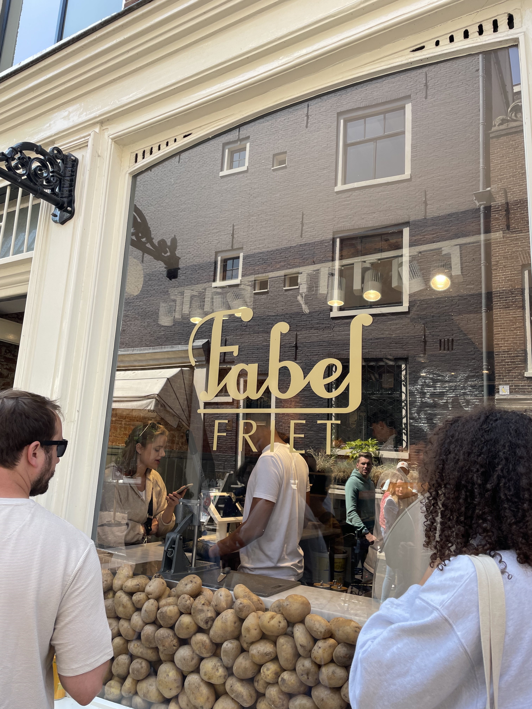
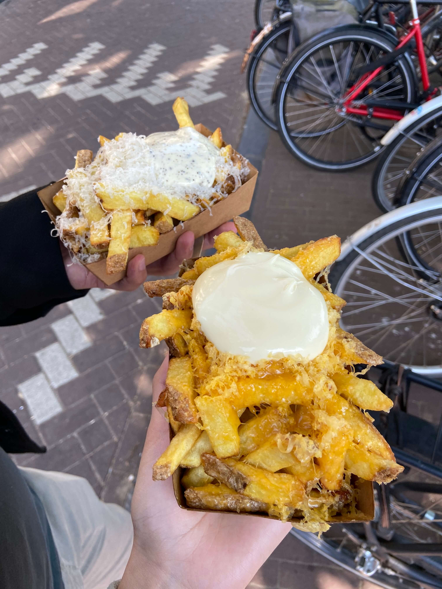
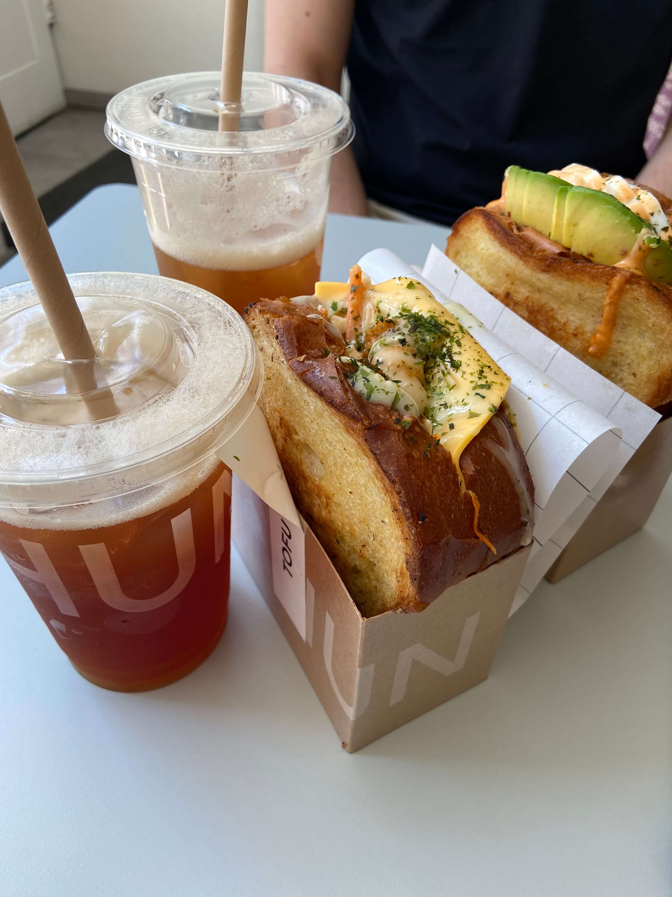
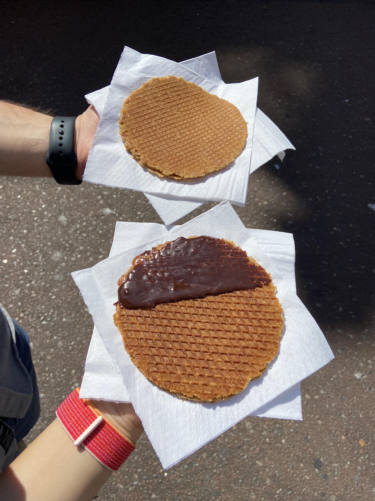
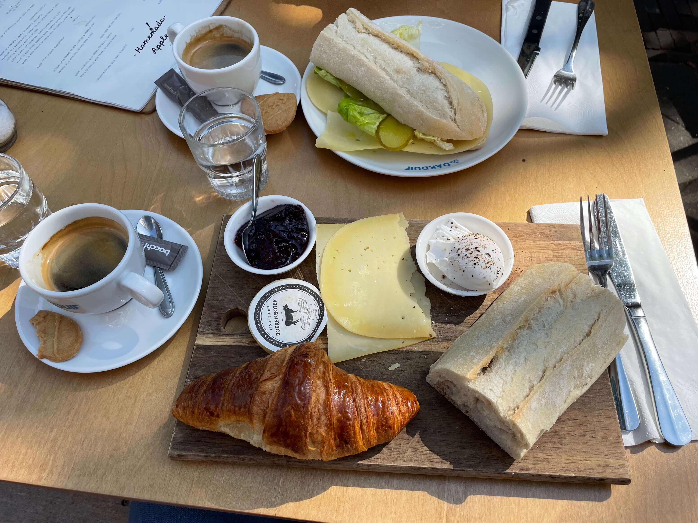
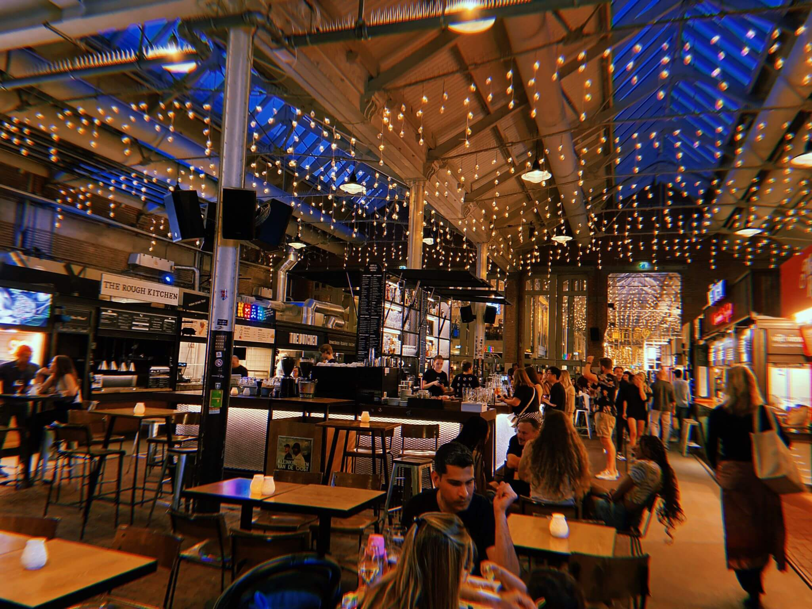
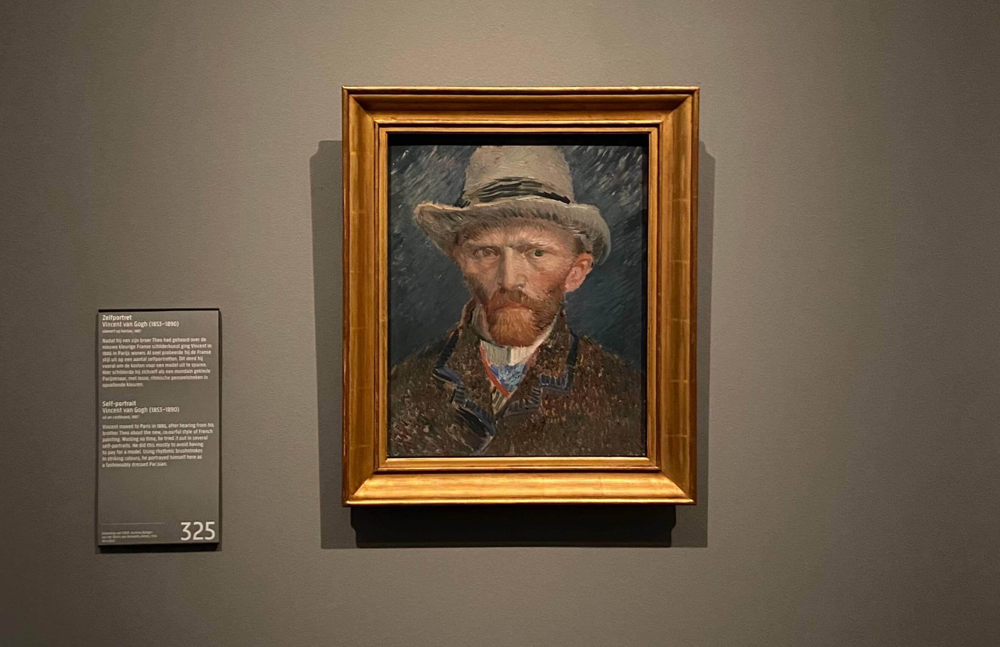
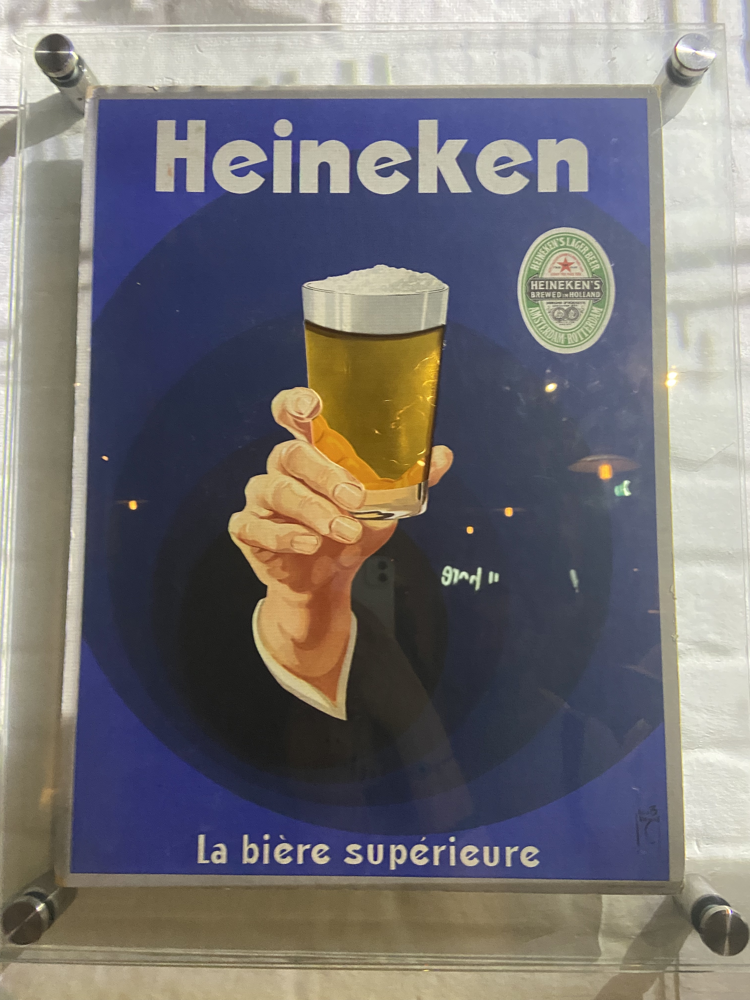
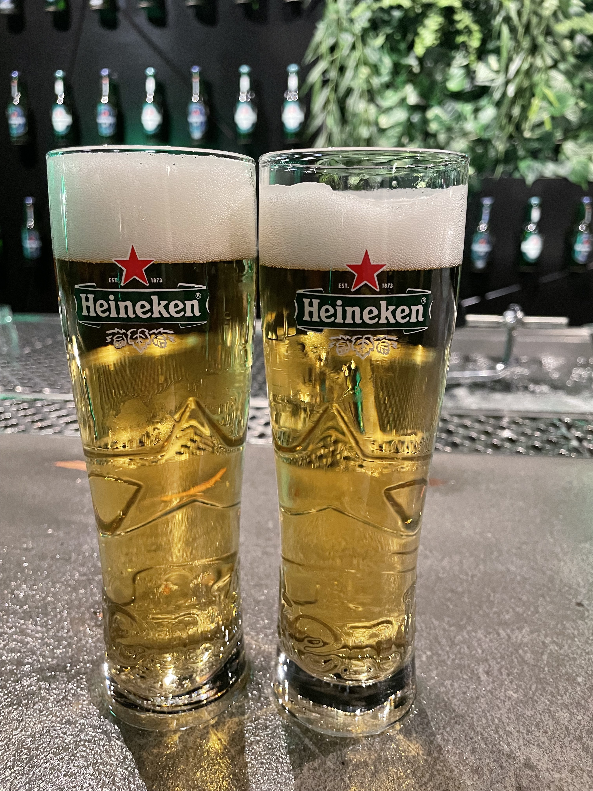

Merhaba, 

2023 Haziran'da 1 haftalık Amsterdam macerasından arda kalan notlarımı iliştirmek istedim. Maksat hem anılar kaybolup gitmesin, hem de Amsterdam seyahati düşünen olursa biraz fikir verebilsin. Bu yazı bolca yemek tavsiyesi de içeriyor, tok karnına okumanız önerilir. Haydi başlayalım. 

---

## Lezzet Durakları 

Seyahat diyince benim aklıma ilk gelen şey yemek oluyor. Çünkü yemek yemek harika bir şey. 😋 Amsterdam'da da daha gitmeden önce pek çok yeri kaydetmiştik. Favorilerimi listeleyeyim. 

### Fabel Friet

Harika patates kızartması yapıyorlar! Taze Hollanda patateslerini, iki fazda kızartarak hazırlıyorlar. Üzerine isteğinize göre harika bir sos + biraz da peynir ile son dokunuşu yapıyorlar. 

  

Sos olarak trüflü mayonez, peynir olarak da parmesanı öneriyorum. Bir de buraya gidecekseniz yaklaşık 1 saat kadar sıra beklemeyi göze almalısınız. Neredeyse her zaman kuyruk oluyor. 

  

### Chun

Sanırım orijini Kore'ye ait bir tostçu. 5 farklı tost türü var, temel seçimi bu listeden yaptıktan sonra arzunuza göre avokado, bacon, karides ya da peynir ekelyebiliyorsunuz. Ben Rib Eye Bulgogi tost + avokado aldım, kız arkadaşım da Tofu Puff tercih etti. Gerçekten enfes bir tosttu. Yolunuz buraya düşerse kesinlikle bir şansı hak ediyor. 

  

Ek olarak ice-tea'leri de kendileri yapıyorlarmış. O da epey lezzetliydi. Sadece... Kahrolası kağıt pipetler... 

Yine ~1 saat sıra beklemeyi göze alarak gidiniz. 

### La Perla Pizzeria

Pizza denemek için Google Maps'te burayı bulduk. Karşılıklı 2 köşe dükkanı tutmuşlar. Birinde pizzalar pişiyor, buradan take-away alıp gidebiliyorsunuz direkt; diğerinde ise oturup yemek yiyebiliyorsunuz. 

Pizzası oldukça lezzetliydi lezzetli olmasına da, öncesinde tadımlık bir zeytin servis ettiler. Böyle bir zeytin yok! 

### Rudi's Original Stroopwafels Albert Cuyp

Amsterdam'ın meşhur atıştırmalığı stroopwafel için gidebileceğiniz en ünlü yerlerden biri burası. Albert Cuyp sokağında bulunuyor. Yine bir miktar sıranın ardından stroopwafel'ınızı alıyorsunuz. Üzerine ilave çikolata da ekletebiliyorsunuz. Hem boyutu büyük, hem de aşırı derecede şekerli olduğunu belirtmek isterim. Bir de biraz aç karnına gitmek mantıklı olacaktır. 

  

### de Dakduif

Albert Cuyp caddesinde kahvaltı mekanı bakarken denk geldik. Yine memnun ayrıldığım bir mekan oldu.

  

### Foodhallen

Burası da içinde dünya mutfağından pek çok lezzeti barındıran büyükçe bir tesis. Pita, hamburger, suşi, noodle, burrito, tapas, taco vb pek çok şey bulmak mümkün. Ortadaki bar alanından da dilediğiniz içeceği alabilirsiniz.

  

### Amsterdam Cheese Museum

Peynirseverler olarak burayı da keyifle gezdik. Her peynir çeşidini tadabiliyorsunuz. Peynirlerle aranız iyiyse bir deneyebilirsiniz. 

---

## Kültür & Sanat

Seyahatimizde çeşitli müze ve etkinlikler mevcuttu. Başlıcaları: 

### Van Gogh Museum

Hollanda denince akla gelen ilk isimlerden biri Vincent Van Gogh'un müzesine gitmeden olmazdı. Rezervasyonu önceden online olarak yaparsanız kafanız rahat olacaktır. 

Yine aynı şekilde kat planını da dijital ortamda takip edebilirsiniz müze içerisinde. 

Müze mağazasını da ihmal etmeyiniz. Çok güzel ürünler mevcut. Müzenin dışında da bir mağaza mevcut olduğunu eklemek isterim.

  

### Rijksmuseum

Amsterdam'daki en önemli müzelerden biri de Rijksmuseum. Hollanda sanatını ve tarihini daha yakından öğrenmek için keyifli bir müze. 

Buraya da önceden biletleri satın alarak gitmekte büyük yarar var.

### Heineken Museum

Heineken markasının güzel bir PR çalışması olan Heineken Experience'ı da Amsterdam'daki yapılacaklar listesine eklemenizi tavsiye ediyorum. Programların kapsamı, fiyatı ve  çeşitliliği değişmekle beraber; biz kanal turunu da barındıran paketi satın aldık. 

Öncelikle rehber eşliğinde müzeyi gezerek Heineken markası ve tarihçesi hakkında bilgi ediniyorsunuz. Bir aşamaya gelince, tüm grup küçük gruplara bölünerek odalara dağıtılıyor. Her tarafı kaplayan ekranlar ve ışık şovlarıyla beraber renkli bir koreografiye tanıklık ettikten sonra bir anda kapılar açılıyor ve elinde bira tepsileriyle görevliler giriyor. Sonrasında parti alanında ikişer bira ikram ediyorlar. Orada kısa bir bira doldurma yarışması da yapıldı. Sonrasında etkinlik sona eriyor ve kanal turu için belirtilen lokasyona gidiyorsunuz. Klasik bir Amsterdam kanal turu ile şehir hakkında bilgiler veriliyor. 

Ben açıkçası programın ilerleyişini oldukça sevdim. Biralarla ilgiliyseniz yine bir şans tanımanız gereken bir program olduğunu düşünüyorum. 

  

  

---

## Gezme & Seyir

### Vondelpark 

Amsterdam'ın en ünlü parklarından birisi. Bisiklet sürmek, yürümek ya da çimenlerde keyif yapmak için ideal bir yer. 

### Rembrandt Park

Kaldığımız yere yakın bir park idi. Böyle devasa ve yemyeşil parkları gezmek çok keyifli bir deneyim. Ülkece büyük eksikliklerimizden birisi böyle kolay ulaşılabilen dev parklar...  

### Zaanse Schans

Amsterdam'dan trenle kolayca gidilebilecek bir yer. Orada da yel değirmenleri ve ortalarından akan genişçe ırmak(?) manzarası eşliğinde güzel bir doğa yürüyüşü yapabilirsiniz. Polenlere dikkat!

### Haarlem

Farklı bir şehir de görelim istedik ve Haarlem'e rotamızı çevirdik. Mimari açıdan çok büyük benzerlik gösteriyordu. Gittiğimiz gün pazartesi olmasına rağmen şehir neredeyse bomboştu. Bir de ilginç bir not olarak her tarafta (arabaların üstünde bile) örümcek ağları vardı. Dolayısıyla genel olarak keyif almadığımız bir seyahat oldu. 

Günübirlik turumuzda Google Maps'ten keşfettiğimiz La Gelateria isimli dondurmacıya da değinmeden geçmek istemedim, oldukça lezzetli dondurmaları mevcut. 

---

## Ulaşım & Bisiklet & Toplu Taşıma

Amsterdam'da ulaşım denince bence ilk övgüyü bisiklet kültürüne yapmak gerekli. Şehirdeki bisiklet yollarının planlaması kusursuz seviyede. Bisikletliye inanılmaz saygı duyuluyor. Ayrı trafik ışıkları mevcut. Coğrafi açıdan da elverişli olunca kullanım oranı daha da yükseliyor sanırım. 

Bisiklet dışında toplu taşıma da oldukça iyi. Şehir içi ulaşımı GVB firması işletiyor, tek bir biletle tramvay, metro ve otobüsleri kullanabiliyorsunuz. 4 gün geçerli bilet için kişi başı 26.5 €, sonra da 2 gün geçerli bilet için kişi başı 15 € ödedik. Sınırsız biniş hakkı sunuyor. 

Yalnız bu biletlerin tarifeli trenlerde geçmediğini de belirtmek gerek. Havalimanına giderken tarifeli trene ayrıca para ödemek gerekli. 

---

## Konaklama 

Turistik bir şehir olduğundan konaklama yeri bulmak hem biraz zor hem de fiyatlar biraz pahalı. Biraz araştırmanın ardından AirBnB'yi tercih ettik. Baktığımız otellerin neredeyse yarı fiyatına denk geliyordu o dönemde. Hatta şöyle bağlantısını da [bırakayım](https://www.airbnb.com/rooms/666550282691690525). Merkezde değil ancak çok uzak da sayılmaz. Girip çıkarken hiçbir insanla muhatap olmamak da bizim için olumlu bir tecrübe oldu. 

---

## Vergi İadesi

Bu arada bilmeyenler varsa Avrupa dışında bir ülkede yaşayıp da oradan alışveriş yaptığınızda, iade formu doldurtup ülkeden çıkarken havalimanında vergi iadesi alabiliyorsunuz. Çünkü orada yaşamadığınız için o ülkeye vergi ödemek zorunda da değilsiniz. Bunun için Schiphol havalimanında ayrılmış birkaç firmanın bankoları mevcut. Biz biraz geç gittik ve inanılmaz derecede uzun bir sırayla karşılaştık. Neyse ki ucuz birkaç ürün aldığımız için çok üzülmedik ve uçağa yetişmek için iade almadan yolumuza devam ettik. Eğer bu şekilde bir iade işlemiyle ilgilenecekseniz erken gitmekte fayda var!

---

## Holafly e-Sim

Yaban ellerde internetsiz telefonsuz ne yapacağız diye düşünen varsa, bu tip kısa dönemli seyahatler için [Holafly](https://esim.holafly.com) adında bir e-Sim servisi var. Hollanda - 1 haftalık paketi satın aldım. Havalimanından inince QR kodu okutarak sistemi aktifleştirdim. Böylece tüm seyahat boyunca limitsiz internetli şebeke servisinden faydalandım. İhtiyacı olan varsa değerlendirebilir. 

---

## Kapanış

Evet, sanırım yazının sonuna geldik. Yolunuz Amsterdam'a düşerse eminim ki yapacak pek çok aktivite, tadacak birçok lezzet var. Yolunuz açık olsun! 🙋🏻‍♂️
