Merhaba, 

Bu yazıda 2023 Ağustos'taki kısa Ege turumuzdan notlarımı ve mekan tavsiyelerimi yazdım. 

---

## Seferihisar 

### Mona Glamping Caravan Suites 

Burası Karavanlar ve tinyhouse’ları barındıran şirin bir konaklama tesisi. Klasik otel tecrübesinden uzaklaşmak için burayı tercih ettik. Birkaç gece Tinyhouse’ta konakladık. Hem işletmeciler çok iyi, hem de bütün kaostan gürültüden patırtıdan uzaklaşıyorsunuz. Cırcır böcekleri, kuş ve doğa sesleri içinde keyifli zaman geçirmek için ideal. İsteyen tesisin ortak mutfağını kullanabiliyor. Ortak alanda kullanılabilecek dart, ok, tavla, okey gibi oyunlar mevcut. Akşamları da ateş yakılıyor. Grup etkinlikleri için de ideal görünüyor. 

  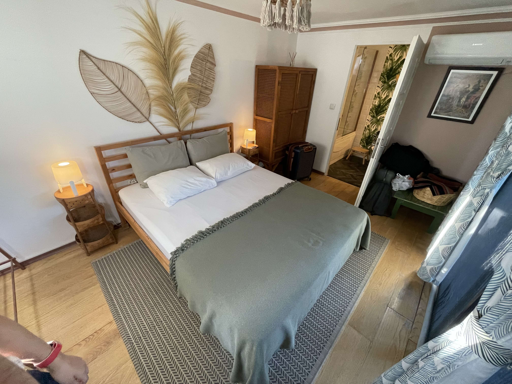

### Artemis Restoran 

_Enginarı her yemekte kullanabilir miyiz?_ sorusuna evet yanıtını vermek için kurulmuş bir restoran. Envai çeşit enginar ürünü yapıyorlar ve hepsi birbirinden lezzetli. Biz ortaya enginar kızartma, enginar tarator aldık, ana yemek olarak da enginar çanağında köfte ve enginar güveç aldık. Hepsi birbirinden lezzetliydi. 

  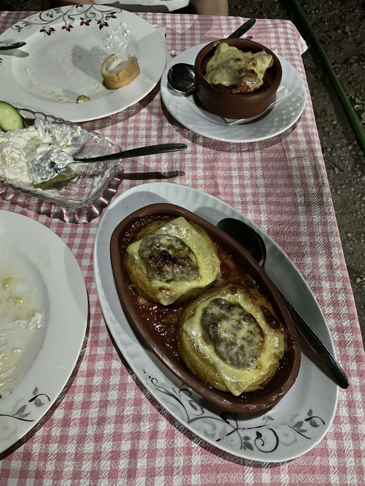

### Sahil Beach

Akarca Plajında yer alan özel bir plaj işletmesi. Hafta içi giriş ücretsizdi. Herhangi bir harcama kotası da yok. Çalışanlar ilgili ve hızlı. Deniz öğleden sonra gittiğimiz için mi bilmiyorum ama çok bulanıktı. Berrak olmayan deniz beni üzüyor. Su sıcaklığı idealdi. 

## Sığacık 

### Sığacık Pazarı 

Çok keyifli ve samimi bir ortamı var. Neredeyse herkes Türk idi, uzun zamandır böyle bir ortam görmemiştim. :) İnsanların yüzü gülüyor. Esnaf çok kibar ve asla sizi kazıklamaya çalışmıyor. Fiyatlar da gayet uygun. Umarım hep böyle kalır. 🧿

  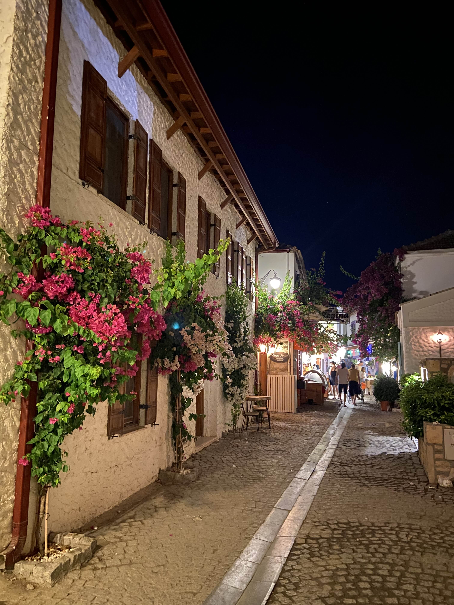

  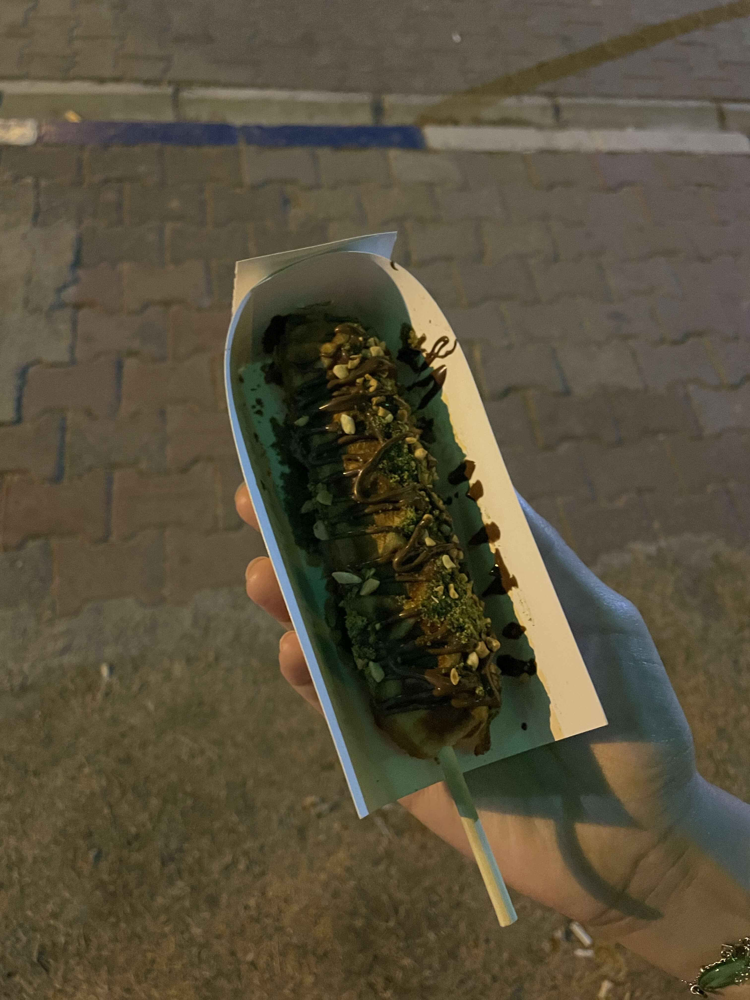

## Urla 

### Sanat Sokağı

Urla’nın şirin sanat sokağı kesinlikle görülesi bir yer. İçinde pek çok keyifli mağaza ve yeme içme yerleri mevcut. 

### Evde Burger & Pub 

Kendi tanımlarıyla 90’ların meşhur burgerlerini yapan keyifli bir restoran. Patlıcanlı olanı denedim ve gerçekten inanılmaz iyiydi. Tüm burgeri yok etmem 10 saniye sürmedi sanırım. Burgerin yanında da Feliz Kulpa isminde bir yerli craft bira denedik, o da gayet lezzetli bir buğday birasıydı. Urla merkeze yolunuz düşerse kesinlikle bu mekana bir şans vermelisiniz. 

  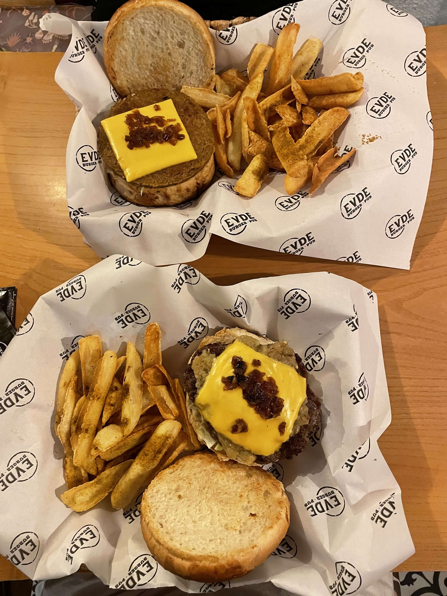

  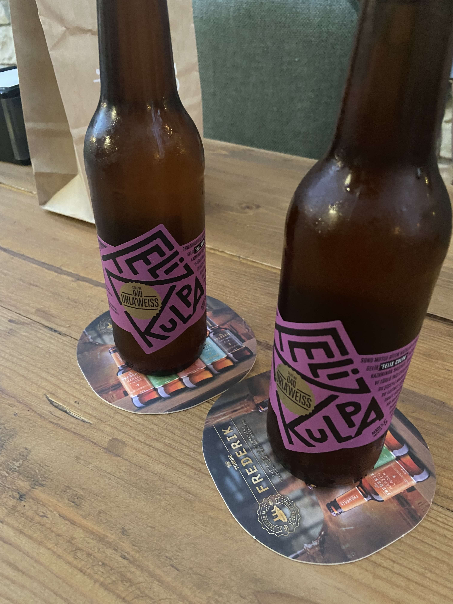

### Girit Pastanesi 1950

Dondurma ilaveli meşhur bademli kazandibini denedik. Oldukça lezzetliydi. Ancak biraz aç gitmenizi öneririm. Oldukça doyurucu ve porsiyonları  büyük. 

  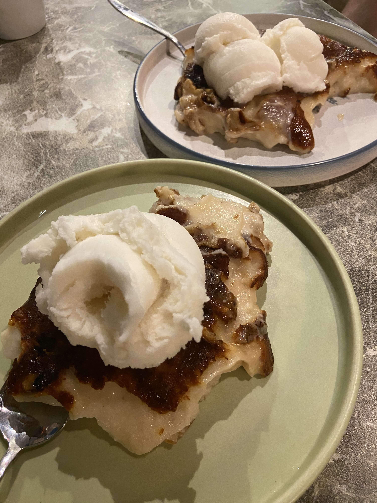

### USCA Şarapçılık

Burada şarap tadımına katıldık. Baştan sona kaliteli bir tecrübeydi. 116 beyaz, 8 ve 73 rose, 66 ve 76 kırmızı şarapları denedik. Bizim favorimiz 73 numara Claret rose şarap oldu. Şarap konusunda da yeni bilgiler edindik. Eğer tadım etkinliği istemezseniz oturup bir şeyler yiyip içebileceğiniz keyifli bir terasları var. Bir de şarapların numaralarını Shakespeare’deki sonelerdeki duygularla eşleşecek şekilde sonelerin numaralarından seçiyorlarmış, keyifli bir bilgi. :) 

  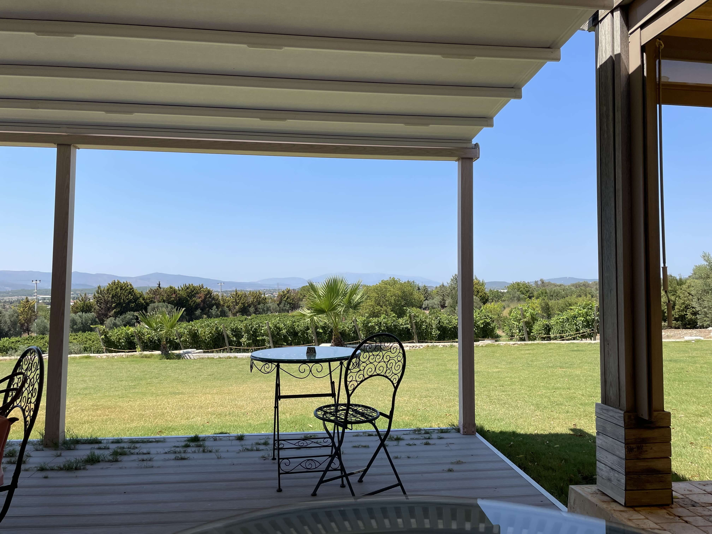

  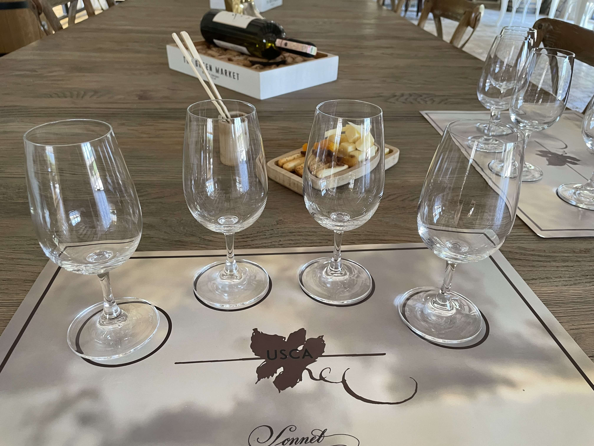

  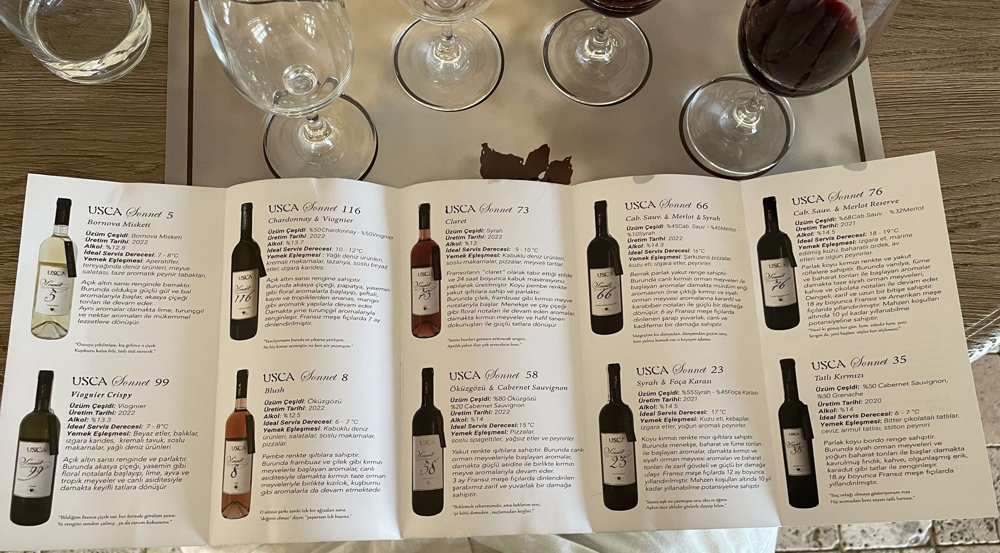

### Altınköy Plajı

Plaj araştırırken burayı duyduk ve rotamıza ekledik. Cam gibi berrak, harika bir denizi mevcut. Dalga yok. Neredeyse tamamı kum bir plaj. Ön tarafı halk plajı şeklinde, arkada da işletme mevcut isteyenler orada da şezlong kiralayabiliyor. Denizi soğuktu ancak girince alışıyorsunuz. Tavsiye olunur. 

## Selçuk 

### Efes Müzesi

Efes antik kentinin nadide parçalarının bir kısmı bu müzede sergileniyor. Bence görülmesi gereken bir müze. Müzekart ile ücretsiz giriş sağlayabiliyorsunuz. 1-2 saatte gezilebiliyor. Efes Antik Kentine gitmeden önce burayı gezmek daha mantıklı olabilir bilgi sahibi olmak açısından. 

  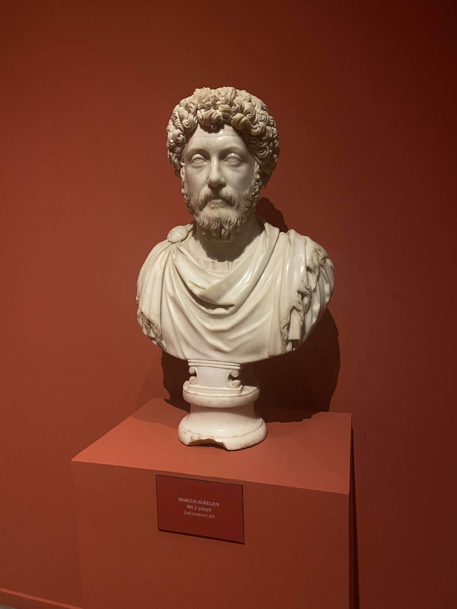

### Efes Antik Kenti 

Türkiye’deki nadide kültürel miraslardan biri. Müzekart ile ücretsiz giriş sağlanabiliyor. Ben biraz tabelaları ve bilgilendirmeleri eksik buldum. İnternet ya da kitap/broşür aracılığıyla daha fazla okuyarak gezmek daha güzel olabilir. Bir de çok sıcak havada gitmemek gerekli. Yazın ziyaret edecekseniz ziyaretinizi gün sonuna doğru ayarlamanızı tavsiye ederim. 

  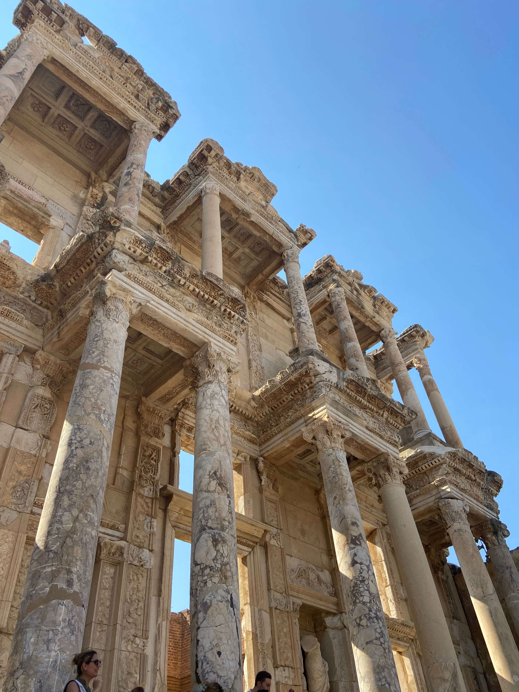

## Tire 

### Kaplan Dağ Restoran 

İzmir Tire’ye bağlı Kaplan dağ köyündeki Kaplan Dağ Restoranda akşam yemeği yedik. Harika manzara ve nefis mezeler yemeğimize eşlik etti. Ana yemek olarak Tire köftesi aldım, aşırı lezzetliydi. Meze olarak da 8 farklı meze denedik, sıralı tam liste: karışık kızartma, ot kavurma, deniz börülcesi, haydari, tarator, çiçek dolması, fava, ekşi bamya. Meze severler için ufak bir taktik, yarımşar porsiyon alırsanız daha fazla ürün deneyebilirsiniz. Porsiyonları da bence tatmin ediciydi. 

  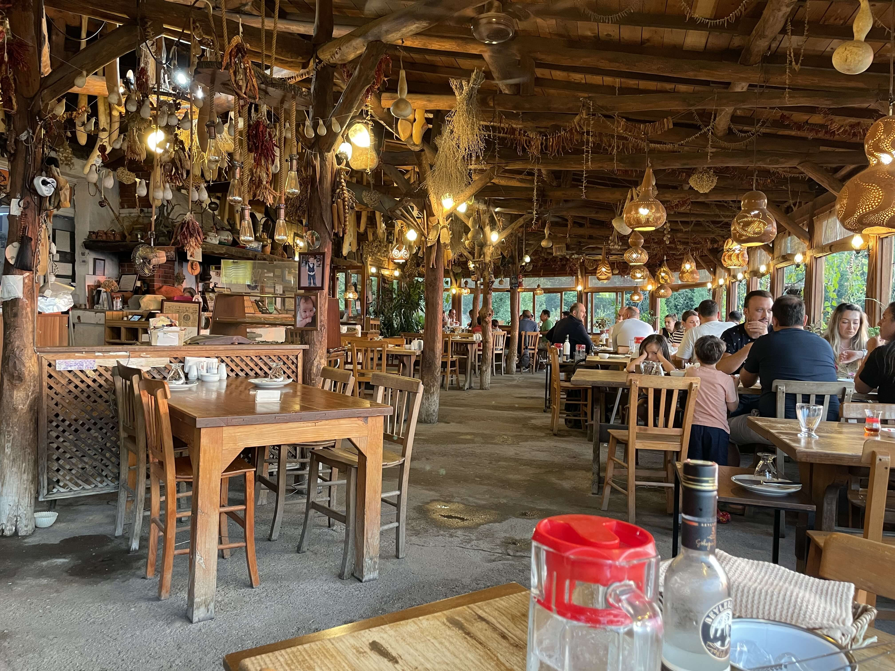

  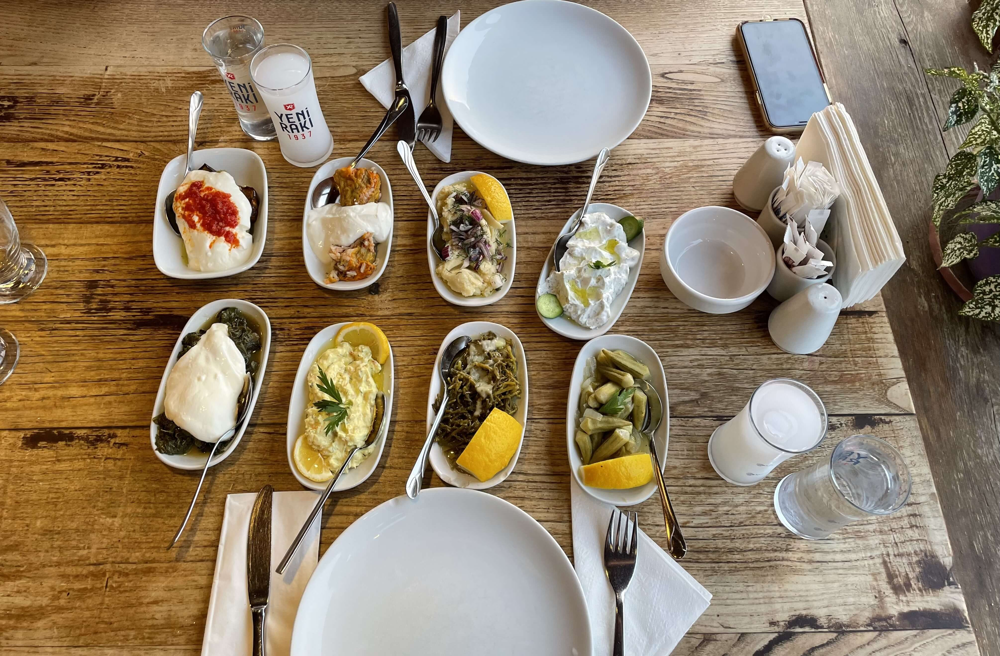

  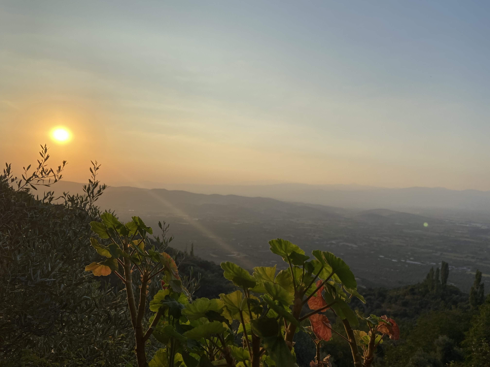

### Nirvana VIP Pansiyon 

Tire Kaplan dağ köyünde yalnızca 2 odadan oluşan butik bir pansiyon. Levent Abinin bizzat kendisi işletiyor ve tatlı bir ortam kurmuş. Daha bahçeye girer girmez mekanın enerjisi ve sıcaklığı size geçiyor. Odanın içerisi de bir köy evi havasına sahip. Sabahleyin horoz ve kuş sesleri eşlik etti. 

---

## Kapanış

Bir yazının daha sonuna geldik. Umarım yolunuz İzmir taraflarına düşecek olursa faydası olur. Şimdilik, hoşça kalın!
