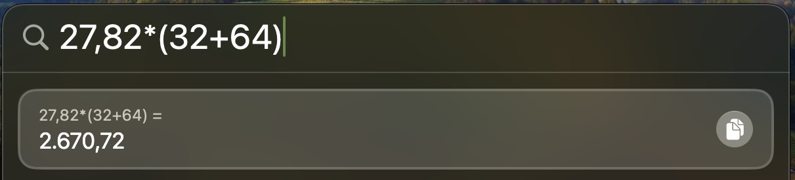
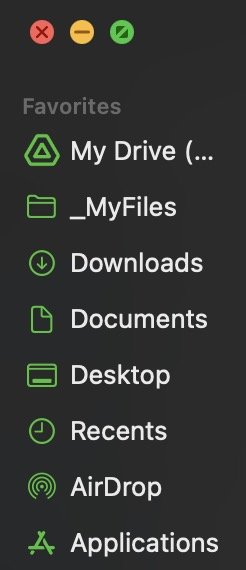
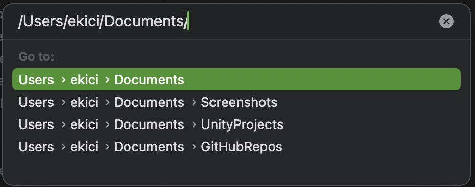
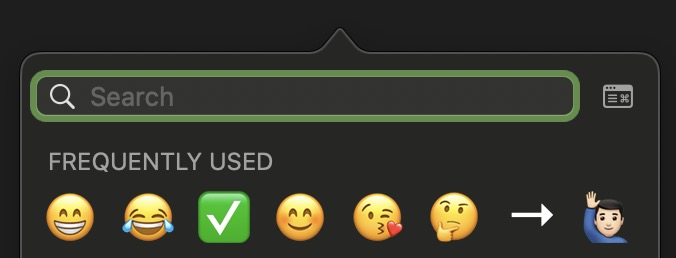
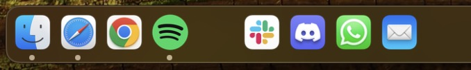
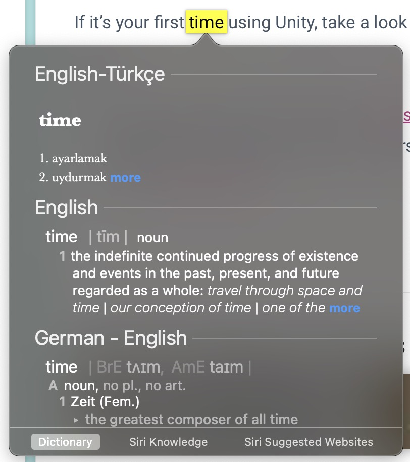
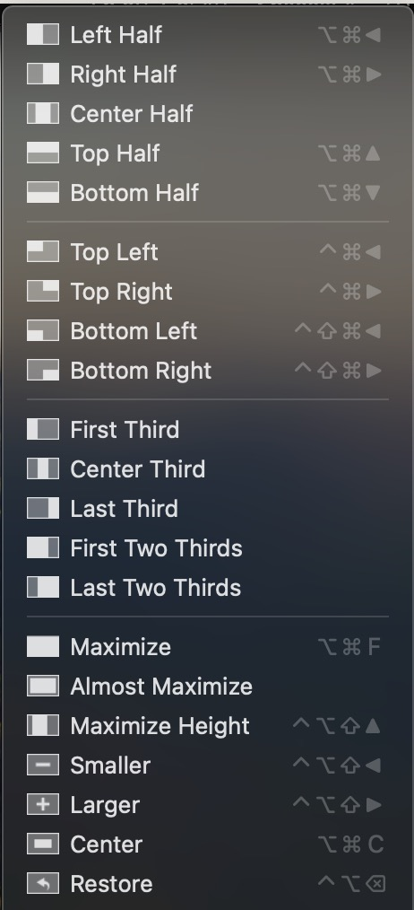

Merhaba, 

Bu yazıda Mac ve macOS'u bana sevdiren ve gündelik işlerimi kolaylaştıran kısayollar ve özelliklerden bahsettim.

---

## Finder ve GUI

* Spotlight kullanımı
    * `cmd + space`

* Spotlight'ı hesap makinesi olarak kullanabilirsiniz. 

<p align="center">
  
</p>

* Finder'da dosya önizleme yapma
    * `space`

* Dosya bilgisini görme
    * `cmd + İ`

* Finder’da yeni Tab ya da Window açma
    * `cmd + T`    ve   `cmd + N`

* Finder’da hiyerarşi 
    * as Columns 
    * Bu hiyerarşi düzeninde kolayca tüm klasörler arasında gezilebiliyor.

* Finder’da Favorites sekmesi 
    * Sıkça baktığınız bir klasör varsa Favorilere eklediğinizde kolayca ulaşabilirsiniz.

<p align="center">
  
</p>

* Finder’da doğrudan adrese gitme 
    * `cmd + shift + G`

<p align="center">
  
</p>

* Gizli dosya ve klasörleri görüntüleme / gizleme
    * `cmd + shift + .`

* Kesme, kopyalama, yapıştırma
    * `cmd + C` 			&emsp;&emsp;&emsp;&emsp;&emsp;ögeyi hafızaya alır
    * `cmd + V` 			&emsp;&emsp;&emsp;&emsp;&emsp;kopyalayıp yapıştırır
    * `cmd + option + V` 	&emsp;kesip yapıştırır (taşır)


## Yazılar 

* Emoji paneli kısayolu 
    * `ctrl + cmd + space`

<p align="center">
  
</p>

* Yazı kısayolu tanımlama 
    * Örneğin `ce@` yazıp boşluğa tıklayınca → `contact.ekici@gmail.com` otomatik olarak basılıyor.
    * Eklemek için `System Prefs / Keyboard / Text Replacements` yolunu izleyin.
    * Gerisi hayal gücünüze kalmış; IBAN, ev/iş adresi, epostalar.

* Yazının tamamını seçme 
    * `cmd + A`

* Yazıda kelime kelime sağa sola gitme 
    * `option + sağ/sol ok`

* Yazıda satırın en sağına ya da en soluna gitme 
    * `cmd + sağ/sol ok`

* Yazıda sayfanın en altına ya da en üstüne gitme
    * `cmd + alt/üst ok`


## Safari & Tarayıcılar

* İnternet tarayıcılarında direkt adres çubuğuna geçme 
    * `cmd + L`

* Safari’de son kapatılan sekmeyi kurtarma
    * `cmd + Z`


## Slack

* Kişi arama
    * `cmd + T`

* Yeni mesaj gönderme / grup kurma 
    * `cmd + N`

* Workspace’ler arasında geçme
    * `cmd + 1/2../9`
    * `control + tab`     ya da    `control + shift + tab`

* URL’i yazıya gömmek
    * Yazıyı tarayıp hafızadaki URL’i `cmd+V` ile yapıştırın

* Yazıyı bold yapma
    * `cmd + B`

* Yazıyı italik yapma
    * `cmd + İ`


## Ekran Görüntüsü

* Tüm ekranı kaydeder
    * `cmd + shift + 3`

* Tüm ekranı kopyalar
    * `cmd + shift + control + 3`

* Fare ile taranan alanı kaydeder
    * `cmd + shift + 4`

* Fare ile taranan aranı kopyalar
    * `cmd + shift + control + 4`

* Tıklanan pencereyi kaydeder
    * `cmd + shift + 4 + space + sol tık`

* Tıklanan pencereyi kopyalar
    * `cmd + shift + control + 4 + space + sol tık`


### Screenshots Konfigürasyonları

Bu komutları bir kez terminalde çalıştırmanız yeterli.

* Screenshotların kayıt yerini değiştirme
    * Masaüstünü kirletmemesi için kullanıyorum.

    ``` 
defaults write com.apple.screencapture location ~/Documents/Screenshots
killall SystemUIServer
```

* Screenshot dosya tipini PNG’den JPG’ye çevirme
    * JPG, alfa kanalı taşımadığı için PNG'den daha az yer kaplıyor.

    ```
defaults write com.apple.screencapture type jpg
```

* Screenshot gölgelerini silme 
    * Gölgeler de ekran görüntülerinin boyutunu artırıyor.

    ```
defaults write com.apple.screencapture disable-shadow -bool true
killall SystemUIServer
```


## Dock

* Dock’ta boşluk bırakmak için

    ```
defaults write com.apple.dock persistent-apps -array-add '{"tile-type"="spacer-tile";}'; killall Dock
```

<p align="center">
  
</p>


## Sözlük

* Trackpad’de Force touch ile lookup yapılabilir 

* Sözlüklere Türkçe-İngilizce sözlük eklenebiliyor. Tarifi şu bağlantıda:
    https://fatihacet.com/mac-os-turkce-ingilizce-sozluk 

<p align="center">
  
</p>


## Tools

* Rectangle app 
    * Masaüstü pencere yönetimi uygulaması.
    * Bu uygulamayla basit kısayollarla pencereleri ekranın belli alanlarına yerleştirebilirsiniz.
    * En sık kullandıklarım: 
        * `cmd + option + sağ/sol ok`
        * `cmd + option + F`

<p align="center">
  
</p>

* Visual Studio Code
    * Text editor olarak hem hafif, hem hızlı, hem kullanışlı uygulama.

* AppCleaner 
    * Uygulamaları `Applications` klasöründen çöpe bırakırsanız bazı dosyaları sistemde halen kalabilir.
    * Detaylı temizlik için bu uygulamayı kullanabilirsiniz. 

* Coconut Battery
    * Mac, iPhone ve iPad'lerin batarya ömrünü görmek için kullanabilirsiniz. 

* Digital Color Meter 
    * Ekrandaki renklerin RGB değerlerini okumaya yarıyor. 
    * Bu uygulama macOS ile birlikte geliyor. Benim çok kullandığım bir uygulama olduğundan belki ihtiyacı olan başkaları vardır düşüncesiyle paylaşmak istedim. 

* iTerm terminal app + oh my ZSH 
    * Özelleştirilebilir terminal arayüzü. 


## iTerm & Terminal Pratikleri

Bu komutları iTerm ya da Terminal istemcisinde çalıştırmalısınız.

* Mevcut dizini bastırma 
    * `pwd`

* Dizin değiştirme 
    * `cd yeni-dizin`
    * `cd ..`  (üst klasör)

* Alias tanımları 
    * iTerm için `zshrc` dosyasını düzenlemek gerekli.
    * Şunun gibi alias'lar tanımlayabilirsiniz: 
        * `alias test="~/Documents/GitHubRepos/test-project"`
    * Artık iTerm'de `test` yazdığınızda direkt bu dizine gider.

* Güvenli şifre/parola yaratma
    * `openssl rand 12 -base64`

* Dosya yaratma
    * `touch dosya.txt`

* Klasör yaratma 
    * `mkdir super-klasor`

* Klasördeki dosyaları ZIP'leme
    * `zip -r -X isim.zip *`

* Herhangi bir text dosyasını VS Code ile açma
    * `code text-dosyasi.txt`
    * Bu işlem için VS Code uygulamasında `code` komutunu shell'e eklemelisiniz. Menu bar'dan tek klikle yapılıyor.


## Xcode Kısayolları 

* Konsolu gösterir ve gizler 
    * `cmd + shift + Y`

* Soldaki hiyerarşi panelini gösterir ve gizler 
    * `cmd + 0`

* Sağdaki paneli gösterir ve gizler 
    * `cmd + shift + 0`

---

## Kapanış

Şirket için hazırladığım slaytın notlarını neden hızlıca bir blog yazısına çevirmeyeyim dedim. Ve sonuç bu oldu. ✅ İleride aklıma bir şeyler geldikçe güncellerim. Kolaylıklar! 
